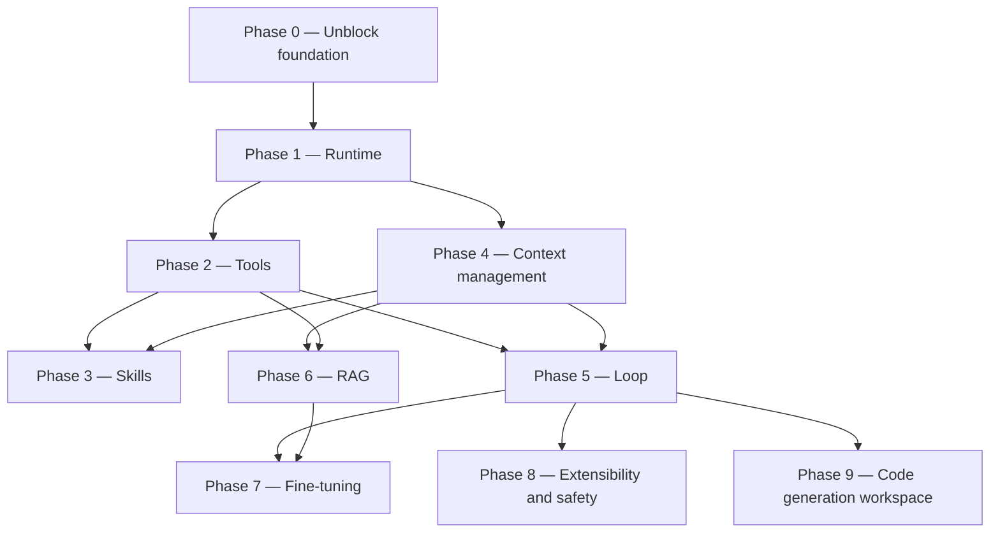

# ROADMAP.md — Catronaut agent system

Implementation roadmap for the remaining core pieces: **Runtime, Tools, Skills, Context, Loop,
RAG, Fine-tuning, Extensibility, Code generation**. Milestones are numbered by conceptual layer;
**the order to build them in is the "Suggested execution order" block near the bottom**, which
diverges from the numbering on purpose.

**The primary product is Phase 9 (`site_gen`)** — a user describes a project and gets real
generated files back. `ui_ux` (review) came first historically and stays a supported domain, but
the build order is optimised for reaching a working generator, not a polished reviewer. See
"Decisions settled" for why, and what that defers.

Read [CLAUDE.md](CLAUDE.md) first — it records current state and conventions.

**Progress: Phases 0, 1, and 2 are complete (2026-08-31).** The service boots, `/health` reports
the model backend, `POST /ui-ux/analyze` answers with a real `qwen3:4b` response, and the entire
tool layer exists and is tested — definition/registry (M2.1), parsing/repair (M2.2), execution
policy (M2.3), and a 4-tool `ui_ux` pack (M2.4). **Nothing calls the tool layer yet** — that is
the loop's job (M5.2). Milestones are marked `[x]` as they land — keep this file updated so other
sessions don't redo finished work.

**Guiding constraints throughout:**

- Dev runs `qwen3:4b`, prod targets `qwen3.8-27b`. Wherever the gap changes a design decision, it
  is called out in a **[4B gap]** note.
- **This service sits behind an existing Go API gateway**, which owns public routing, versioning
  and JWT. No milestone below adds auth, rate limiting, CORS, or path versioning here — if a
  milestone seems to need one, it belongs in the gateway instead.
- **Terminology — "harness" is overloaded, and the collision matters.** Phase 1 is named
  **Runtime** precisely to avoid it: that phase is boot, config, lifecycle, run context, and
  observability, nothing more. In the wider agent literature "harness" means the *whole* agentic
  runtime — tools, skills, context management, the loop, hooks, permissions, sub-agents — which
  here is **Phases 2–5 plus Phase 8**. The agent harness proper begins at Phase 2.
  **Phase 1 being `[x]` does not mean the harness in that broader sense is done.** When a review
  or a milestone says "harness", check which sense is meant.

---

## Dependency overview



The three hard ordering rules:

- **Tool-call format (M2.1–M2.2) must be frozen before the loop is finalized (M5.2).**
  The loop's control flow *is* "did the model emit a valid tool call?" — you cannot write the
  termination and retry conditions until that answer has a stable shape.
- **The token budgeter (M4.1) must exist before RAG injection (M6.4).**
  Retrieval that cannot be told "you have 1,800 tokens" will silently blow the 4B's context.
- **Phase 8 must not start before the loop (Phase 5) is stable.** Its hook event set is derived
  from the loop's real seams; freeze it earlier and it will be the wrong set.

**Phase 3 (Skills) is numbered before Phase 4 but does not execute before it:** M3.2 needs the
budgeter and the assembly pipeline that Phase 4 builds. The number reflects where skills belong
conceptually — beside tools, as the second thing a domain agent is given — not the build order.
See "Suggested execution order".

---

## Phase 0 — Unblock the foundation — DONE (2026-08-29)

All four milestones landed. **Do not redo this phase.**

### [x] M0.1 — `app/core/config.py`
Shipped: pydantic-settings `Settings` + `settings` singleton + `get_settings()`.
Exposes `app_name, app_env, ollama_base_url, model_name, model_num_ctx, model_timeout_s,
model_think`, plus `is_dev` / `expose_raw_response` properties.
`.env.example` rewritten to match and `.env` seeded from it.
Postgres/Redis left commented out, pending a decision at M4.4.
**Gotcha for future edits:** `Settings` must keep `protected_namespaces=()` — pydantic v2 reserves
the `model_` prefix and this app deliberately uses `model_name` / `model_num_ctx`.

### [x] M0.2 — `app/core/model_provider/`
Shipped `base.py` (`ModelProvider` ABC) and `ollama_provider.py`.
The frozen signature is:
`async chat(messages, *, tools=None, think=None, **options) -> dict`, plus `aclose()`,
`extract_content(raw) -> str`, and `embed()` (raises `NotImplementedError`, see M6.3).
`OllamaProvider` uses a single shared `httpx.AsyncClient`, always sends `num_ctx` explicitly,
maps transport/status/timeout failures to `ProviderError`, and adds `health()` for `/health`.

**`extract_content` is not boilerplate — it encodes a measured model quirk.** See M0.5.

### [x] M0.3 — Dependencies and env hygiene
`requirements.txt` re-encoded UTF-8 and completed (`pydantic-settings`, `httpx`, `pytest`,
`pytest-asyncio`). `Dockerfile` written (host-Ollama note included). `.gitignore` reworked so
directory layout survives via `.gitkeep` while contents stay ignored. `__init__.py` added to every
package — the project no longer relies on implicit namespace packages.

### [x] M0.4 — Boot + smoke test
Service boots; `/health` returns `{"status":"ok","model_backend":"up","domains":["ui_ux"]}`.
`tests/test_api.py` (8 tests, model stubbed) passes. Live model checks live in
`scripts/smoke_test.py`, deliberately outside pytest because real generation takes minutes.

Also landed alongside Phase 0, ahead of schedule:
- **Error layer (part of M1.2):** `app/core/exceptions.py` — `CatronautError` tree and a handler
  returning `{"error": {"code", "message"}}`. `ProviderError` → 502, `UnknownDomainError` → 404.
  Verified in practice: a real model timeout returned a clean 502, not a 500 stack trace.
  *Retry is still outstanding — see M1.2.*
- **Declarative registry (M1.3):** `app/domains/registry.py`. Adding a domain no longer touches
  `app/core/`.
- **Routing flattened for the gateway:** `app/api/v1/` collapsed to `app/api/`, and routes are
  domain-relative (`POST /ui-ux/analyze`). The Go API gateway in front of this service owns
  public routing, versioning and JWT — this service must not duplicate them.

### [x] M0.5 — Model behaviour, measured

Tested directly against the running Ollama 0.33.1. These numbers drive real code and should not be
re-litigated from memory:

| Setting | Latency | Tokens | Outcome |
|---|---|---|---|
| `think: false` | 44s | 646 | `done_reason: stop`, complete answer |
| `think: true` | 105s | 900 | pure reasoning, cut off, **no answer** |
| `/no_think` suffix | 22s | 256 | reasoning only, cut off |

Conclusions now baked into the code:
- **`qwen3:4b` cannot be stopped from reasoning.** `think: false` only stops Ollama from splitting
  reasoning into `message.thinking`; the reasoning then leaks into `message.content` ending in a
  bare `</think>` with no opening tag. `OllamaProvider._LEAKED_THINK` strips it, with regression
  tests.
- **`MODEL_THINK=false` is the correct setting**, because it measurably shortens reasoning.
- **CPU-only inference at ~8 tok/s.** `MODEL_TIMEOUT_S` raised 300 → 600 after a real 300s timeout.
- **Do not cap `num_predict` tightly** — it truncates mid-reasoning and yields an empty answer.
- **`/api/embed` is unavailable** on this runner ("server does not support embeddings") → M6.3
  needs a dedicated embedding model.

---

## Phase 1 — Runtime (scaffolding, config, lifecycle)

Everything around the model call: how a request becomes a run, what a run carries, how it fails,
and how you see what happened.

**Renamed from "Harness" (2026-08-31)** to end the collision with the broader sense of that word.
This phase is scaffolding only — it makes a *service*, not an *agent*. The agent harness starts at
Phase 2. See the terminology note at the top of this file.

### [x] M1.1 — Model profiles — DONE (2026-08-30)

Shipped [app/core/model_profile.py](../app/core/model_profile.py): a frozen `ModelProfile`
dataclass (`name, context_window, supports_vision, supports_native_tools, tool_call_style
[native|prompt|none], reliability_tier [small|large]`) plus `get_model_profile(model_name)`,
keyed by exact Ollama tag. An unregistered `model_name` falls back to a conservative default
profile with a logged warning, instead of guessing or crashing.

**⚠ The tool-calling values this milestone shipped for `qwen3:4b` were later measured and found
wrong — see M2.2.** M1.1 registered `qwen3:4b` and `qwen3:8b` as "no native tools, prompt-style"
purely as a guess, made while nothing consumed those fields. M2.2 measured the real model:
`qwen3:4b` is `supports_native_tools=True`, `tool_call_style="native"`. `qwen3:8b` stays on the
prompt path — same family, but never measured. `qwen3.8-27b` (`large`, vision, native tools) is
unchanged and still unverified, since that tag isn't running anywhere yet.

Wired in, not left dead:
- `Settings.model_profile` — a property on `settings`, so `settings.model_name` is still the one
  source of truth; nothing else needs to be kept in sync.
- `lifespan.py` logs the active tier on startup and **warns if `MODEL_NUM_CTX` exceeds the
  profile's `context_window`** — a real misconfiguration guard, not just informational.
- `GET /health` now reports `model_tier` and `supports_vision`, so tier is visible to whatever
  calls this service (the Go gateway, monitoring) without reading logs.
- `UIUXAgent` logs (does not block) when a request includes `image_base64` but the active
  profile has no vision support — diagnostic breadcrumb only; the field stays accepted on every
  model, matching the "vision stays optional and unblocking" decision in `CLAUDE.md`.

Deliberately NOT done here (belongs to later milestones that consume the profile, not this one):
`tool_call_style` and `supports_native_tools` are declared but unused until Phase 2 (M2.2 branches
tool-call parsing on this field). `reliability_tier` is unused until M5.3 (loop iteration caps per
tier). Do not wire those early — the profile's job in M1.1 was only to exist as a single source of
truth; consuming it for tools/loop belongs to those milestones.

**Depends on:** M0.2. ✅

### [x] M1.2 — Error handling and resilience — DONE (retry decided against, 2026-08-30)
- [x] Exception hierarchy (`CatronautError` → `ProviderError` / `UnknownDomainError` /
      `DomainError`) and a FastAPI handler mapping to 4xx/5xx.
- [x] Provider-level timeout, with transport/status/timeout failures mapped to `ProviderError`.
- [x] `extract_content` raises instead of silently returning `""` on a malformed response.
- [x] **Decided: no bounded retry here.** The Go gateway in front of this service already retries.
  Adding a second retry layer inside this service would stack on top of it — and a single call
  already takes 44s–600s on the dev CPU box, so stacked retries risk multi-minute worst-case
  latency for no real gain: a timeout or connection failure here usually means Ollama is
  overloaded or down, and an immediate retry doesn't fix that, only a backoff at the layer with
  visibility across all backends does (the gateway). Add `ToolError` when Phase 2 lands, still no
  retry.
**Depends on:** M0.2. ✅

### [x] M1.3 — Declarative domain registry — DONE
`app/domains/registry.py` holds `AGENT_REGISTRY`; `Orchestrator` is constructed with it from
`lifespan.py` and no longer imports any domain. Adding a domain is now: new folder under
`app/domains/`, one line in the registry, one router — `app/core/` untouched. Checklist documented
in README ("Adding a domain").

### [x] M1.4 — Run context object — DONE (2026-08-30)

Shipped [app/core/run_context.py](../app/core/run_context.py): a `RunContext` dataclass with
`run_id` (auto-generated, 12 hex chars), `domain`, `model_profile` (a snapshot from
`settings.model_profile` at run start), `session_id` (always `None` today — no session store
until M4.4), `created_at`, and three fields reserved for later milestones to write into without
another round of call-site changes: `token_budget` (M4.1), `steps` (M5.2 loop trace),
`tool_results` (M2.3).

Wired in, not left dead:
- `Agent._new_run_context()` and `Agent._build_output(run, raw, content)` on the base class
  ([app/core/agent_base.py](../app/core/agent_base.py)) — every agent creates one run per
  `handle()` call the same way.
- `UIUXAgent.handle` creates the run first thing, logs `run_id=... domain=... start` / `...done`,
  and includes `run.model_profile` in the vision-mismatch log line instead of re-reading settings.
- **`AgentOutput.run_id` is now part of the API response.** This is the concrete payoff: the
  caller (the Go gateway) gets a ID it can correlate against this service's logs when something
  goes wrong, without needing structured log shipping yet (that's still M1.5).

Deliberately NOT done here: no structured/JSON logging (M1.5), no session persistence (M4.4,
`session_id` stays `None`), nothing yet writes to `token_budget` / `steps` / `tool_results` —
those stay empty until the milestones that own them land.

**Depends on:** M1.1. ✅

### [x] M1.5 — Observability — DONE (2026-08-30), scoped to what has a consumer today

Shipped: `ModelProvider.extract_usage(raw) -> RunUsage` (`prompt_tokens`, `response_tokens`,
`duration_s`), implemented in `OllamaProvider` from Ollama's own `prompt_eval_count` /
`eval_count` / `total_duration`. Same reasoning as `extract_content`: these are Ollama-specific
field names, so the extraction lives in the provider, not in `agent_base.py` or `RunContext`
directly. `Agent._build_output` calls it, stores the result on `run.usage`, and logs one
structured "done" line per request: `run_id=... domain=... done prompt_tokens=... 
response_tokens=... duration_s=...`. Verified live against `qwen3:4b`.

**Deliberately deferred, not forgotten:**
- **Tool calls attempted/succeeded, truncation events** — can't be logged before Phase 2 (tools)
  and Phase 4 (context budgeting) exist to produce them. `RunContext.tool_results` /
  `token_budget` are already in place from M1.4 for those milestones to fill in; M1.5 doesn't
  need to touch them again.
- **JSONL persistence to `data/`** (the ROADMAP text called this optional) — skipped for now on
  purpose: there is no consumer for it yet. The first real consumer is M7.2 (fine-tuning data
  collection), which needs richer records anyway (full input/output, accept/edit/reject labels),
  not just token counts. Building a persistence layer now would mean guessing that shape twice.
  Revisit at M7.2 instead of building it speculatively here.
- **True structured (JSON) logging** — still plain-text `logging` with `key=value` tokens in the
  message, not a JSON formatter. Sufficient for grepping by `run_id` today; revisit only if log
  aggregation tooling is introduced.

**Depends on:** M1.4. ✅

---

## Phase 2 — Tools — the agent harness proper starts here

Phase 1 built a service that calls a model. From here on the phases build the thing the wider
literature calls the **agent harness**: what the model can invoke (Phase 2), what knowledge it is
given (Phase 3), what fits in its window (Phase 4), how many turns it gets (Phase 5), and what it
is allowed to do (Phase 8). Tools come first because every one of those depends on the tool-call
format being frozen.

### [x] M2.1 — Tool definition and registry — DONE (2026-08-31)

Shipped [app/core/tools/base.py](../app/core/tools/base.py): `Tool` ABC with `name`,
`description` (ClassVar), `args_schema: type[BaseModel]`, `async run(self, args: BaseModel) ->
Any`. `run()` always receives an already-validated `args_schema` instance — a `Tool` subclass
never sees raw model output; that extraction/validation/repair layer is M2.2, not this milestone.

Shipped [app/core/tools/registry.py](../app/core/tools/registry.py): `ToolRegistry(tools)` —
raises `ValueError` on a duplicate `name` at construction time, `.get(name)` resolves a tool
(`None` if unknown), `.schema()` returns a backend-agnostic
`[{name, description, parameters}]` list (`parameters` from `args_schema.model_json_schema()`)
for both the native path (Ollama `tools` param) and the prompt-based fallback (M2.2) to read.
`__len__`/`__iter__` for allowlisting/capping checks in M2.3/M2.4.

Scope deliberately narrow: no concrete tools yet (that's M2.4), no
`app/domains/<domain>/tools/` directory created yet either — empty scaffolding with nothing to
put in it. Not wired into `Agent`/`Orchestrator`/`RunContext` yet; `RunContext.tool_results` (from
M1.4) stays the landing spot once M2.3 exists to fill it. Tests in
[tests/test_tools.py](../tests/test_tools.py): resolve-by-name, schema shape, duplicate-name
rejection, `__len__`/`__iter__`, and `run()` on validated args (5 tests, all stub tools — no model
calls).

**Depends on:** M1.1. ✅
**[4B gap]** Still applies to whoever writes the *first real* tool at M2.4: flat args (no nested
objects), ≤3 params, enums over free strings, `snake_case` verb-noun names, one-line descriptions.
Cap the exposed tool count at ~3–5 per domain in dev — the 4B's selection accuracy falls off
sharply beyond that. Nothing about `Tool`/`ToolRegistry` itself enforces this; it's a convention
for whatever populates the registry.

### [x] M2.2 — Tool-call parsing, validation, repair — DONE (2026-08-31)

**Measured first, against the real `qwen3:4b` — and the measurement overturned this
milestone's stated premise.** Ollama reports `capabilities: ['completion', 'tools', 'thinking']`
for `qwen3:4b`, and all three probes succeeded:

| Probe | Result | Latency | Response tokens |
|---|---|---|---|
| Native (`tools` param) | correct `message.tool_calls`, right args | 37.3s | 510 |
| Prompt envelope | clean `{"tool", "args"}`, unfenced | 29.1s | 633 |
| No tool needed | plain-text answer, **no invented call** | 20.8s | 466 |

Three consequences, all now in code:

1. **`ModelProfile` for `qwen3:4b` was wrong** — it declared `supports_native_tools=False` /
   `tool_call_style="prompt"`, guessed back at M1.1 while the field had no consumer. Corrected to
   `True` / `"native"`, with the measurement in a comment so it is not "fixed" back from memory.
   `qwen3:8b` is left on the prompt path: same family, but **not measured**.
2. **The `</think>` leak applies to tool calls too.** All three probes leaked reasoning into
   `content`; the call or answer follows the bare closing tag.
3. **On the native path `content` after `</think>` is empty**, and `extract_content` raises on
   empty content by design. So a tool call must never be resolved through `extract_content` — the
   resolver asks for structured calls first. There is a regression test for exactly this.

**The frozen envelope** (prompt path) — M7.3 plans to fine-tune on it, so treat it as an API:

```json
{"tool": "check_contrast", "args": {"foreground": "#999999", "background": "#ffffff"}}
```

Shipped [app/core/tools/parsing.py](../app/core/tools/parsing.py) — pure, no I/O:
`ToolCall(name, args, raw_args)` / `NoToolCall(content)` / `ToolCallFailure(reason, detail)`;
`parse_envelope()` (strips fences, takes the first *balanced* object so leaked reasoning and
trailing prose do not break it, brace-counting with string/escape awareness); `validate_call()`
against the registry and `args_schema`; `build_tool_instructions()` for the prompt path.

Shipped [app/core/tools/resolver.py](../app/core/tools/resolver.py) — `ToolCallResolver`, holding
the milestone's one piece of I/O: **exactly one** repair turn, tested to never loop.
Path selection is `ModelProfile.tool_call_style`, never a model-name check.

Also shipped, because the tool layer must not read provider-shaped dicts (CLAUDE.md §2,
invariant #3): `ModelProvider.extract_tool_calls(raw) -> [{"name", "arguments"}]`, implemented in
`OllamaProvider` (tolerating both dict and JSON-string arguments), plus request-side wrapping of
`ToolRegistry.schema()` into Ollama's `{"type": "function", ...}` envelope inside the provider.

**Terminal states, frozen for M5.2's loop:** a `NoToolCall` is a *success*, not an error — the 4B
often answers directly when it could have called a tool, and prose on the repair turn is likewise
accepted rather than failed.

22 new tests in [tests/test_tool_parsing.py](../tests/test_tool_parsing.py) (44 total), including
the measured 4B strings as regression fixtures and an assertion that the repair fires exactly once.

**End-to-end verified against the live model, not just stubs** — `scripts/tool_call_check.py`
runs the real `ToolCallResolver` over a real `qwen3:4b` and expects `ToolCall, ToolCall,
NoToolCall`:

| Scenario | Result | Latency | Response tokens |
|---|---|---|---|
| native / needs tool | `ToolCall`, args correct, tool executed | 79.0s | 1045 |
| prompt / needs tool | `ToolCall`, args correct | 24.7s | 379 |
| native / no tool needed | `NoToolCall` with a usable answer | 24.3s | 374 |

Note the spread: the same native scenario measured 37.3s/510 tokens in the probe and 79.0s/1045
in the live check. **Latency and reasoning length on this box vary by more than 2x run to run** —
do not tune timeouts or token budgets against a single sample.
**Depends on:** M2.1. ✅ **Blocks M5.2 — this format is now frozen.**
**[4B gap]** The premise "design the fallback first, native is the 27B's optimization" **did not
survive contact with the model**: native works on the 4B, is cleaner (no parsing at all), and costs
fewer response tokens. Both paths are implemented and tested, and the prompt path remains the
fallback for models with no `tools` capability. Still unverified: selection accuracy with 3–5 tools
in one registry — the probe used one tool, so the ~3–5 cap stays a convention, not a measurement.

### [x] M2.3 — Execution policy — DONE (2026-08-31)

Shipped [app/core/tools/executor.py](../app/core/tools/executor.py) — `ToolExecutor.execute(run,
call)` takes an already-validated `ToolCall` (M2.2) and always returns a `ToolExecutionResult`
(denied / timed out / errored / succeeded), never a raised exception and never an unbounded
string. In order: (1) allowlist check via `ToolPolicy`, (2) `tool.run(args)` under
`asyncio.wait_for(timeout=tool.timeout_s)`, (3) any exception from the tool itself is caught, (4)
the result string is truncated at `max_result_chars` (default 2000) with a `[truncated]` marker.
Every result — including denials — is appended to `run.tool_results` (the M1.4 field this was
reserved for).

Shipped [app/core/tools/policy.py](../app/core/tools/policy.py) — `ToolPolicy`, a name allowlist
only: `is_allowed(name)`, `allow_all(registry)` for domains/tests with no restriction. Deliberately
this narrow — capability declaration (`fs_read`/`fs_write`/`network`/`subprocess`) and a single
`pre_tool_call` enforcement seam is M8.2, which the ROADMAP explicitly defers until the loop is
stable. Building that now would mean guessing at an enforcement point with no loop to hang it on.

`Tool` (M2.1) gained two class attributes: `read_only: ClassVar[bool]` — **no default**, so a
side-effecting tool cannot pass as safe by omission — and `timeout_s: ClassVar[float] = 30.0`.
`read_only`'s one consumer today: `ToolExecutor` logs a side-effecting call's completion at
WARNING instead of INFO, for an audit trail. It does not gate anything — gating is M8.2's job.

8 new tests in [tests/test_tool_execution.py](../tests/test_tool_execution.py) (52 total):
allow/deny, timeout, an exception that must not escape the executor, truncation, and that both
successes and denials land in `run.tool_results`.

**Depends on:** M2.2. ✅
**[4B gap]** Result truncation is a context-budget concern, not a nicety: one untruncated tool
result can consume the 4B's entire remaining window. The 2000-char default is a placeholder —
M4.1's token budgeter is the real owner of this number once it exists.

### [x] M2.4 — First real tool pack for `ui_ux` — DONE (2026-08-31)

Shipped four tools under [app/domains/ui_ux/tools/](../app/domains/ui_ux/tools/), exported as
`TOOLS` (a ready-made list for `ToolRegistry(TOOLS)` once M5.1/M5.2 wires it into an agent — still
nothing does):

- **`check_contrast(foreground, background)`** — [accessibility.py](../app/domains/ui_ux/tools/accessibility.py).
  A real WCAG relative-luminance/contrast-ratio implementation (not a stub), returning
  PASS/FAIL for AA normal, AA large, and AAA. Hex format is validated in `ContrastArgs` via a
  `field_validator`, not inside `run()` — a malformed hex string is an M2.2 validation failure
  (eligible for the one repair turn), not a runtime tool error routed through M2.3's
  caught-exception path.
- **`lookup_heuristic(topic)`** — [heuristics.py](../app/domains/ui_ux/tools/heuristics.py). Static
  lookup over Jakob Nielsen's 10 usability heuristics (public domain knowledge, summarized in our
  own words). `topic` is a `Literal` of 10 fixed values — an enum, not free text, per the M2.1
  [4B gap] note. **Deliberately a placeholder**: M6.4 (RAG) replaces this file outright, not
  extends it.
- **`format_review(summary, issues, recommendations)`** — [report.py](../app/domains/ui_ux/tools/report.py).
  Three flat params (the [4B gap] cap), `issues`/`recommendations` are plain string arrays, not
  nested objects. Formats into a Markdown report with only the sections that have content.
- **`fetch_docs(url)`** — [web.py](../app/domains/ui_ux/tools/web.py). **Added beyond the original
  suggested set**, at the user's request, to let the agent pull in external reference material.
  This is the one tool in the pack that makes an outbound request — see the M8.2 update below for
  why that changes this pack's security assessment, and what mitigates it.

**Schema-shape regression tests, not just behavior tests**: `tests/test_ui_ux_tools.py` asserts
every tool in the pack has ≤3 params and no nested-object parameter — turning the M2.1 [4B gap]
convention into something CI actually enforces, not just a comment anyone could drift from.

**`fetch_docs`'s SSRF mitigation** (mirrors OpenDesign's `assertAndFetchExternalAsset` pattern —
see the chat history around 2026-08-31 for that read-through): `_assert_fetchable_url` resolves
the hostname via `socket.getaddrinfo` and rejects the request if **any** resolved address is
loopback, private, link-local (covers the `169.254.169.254` cloud-metadata address specifically),
reserved, multicast, or unspecified — checked *before* the request is made, so a hostname
resolving to an internal address never reaches `httpx`. Redirects are never followed
(`follow_redirects=False`); a 3xx is treated as a failure rather than silently chased somewhere
the guard didn't check. Download is capped at 200KB, output at 4000 chars (on top of, not instead
of, M2.3's generic 2000-char truncation). HTML→text uses stdlib `html.parser` — no new dependency
for one tool. 10 tests cover the guard directly (DNS-mocked, no real network) plus one test that
runs a blocked address through the *full* M2.3 `ToolExecutor` to confirm SSRF rejection surfaces
as a clean failed result, not a crash.

**Live-verified**, not just stubbed: `scripts/ui_ux_tool_pack_check.py` registers all four tools
together and runs four prompts against real `qwen3:4b`, including one real fetch of
`http://example.com/` (IANA's RFC 2606 documentation domain — safe to depend on in a script).
This is also the measurement M2.2 flagged as missing: tool-selection accuracy had only been
checked with **one** tool registered.

| Prompt | Expected | Got | Latency / tokens |
|---|---|---|---|
| contrast question | `check_contrast` | `check_contrast`, correct args | 43.1s / 357 |
| heuristic question | `lookup_heuristic` | `lookup_heuristic(topic=error_prevention)` | 13.8s / 324 |
| "fetch example.com" | `fetch_docs` | `fetch_docs(url=http://example.com/)` | 13.8s / 334 |
| no-tool question | no call | answered directly, no invented call | 24.2s / 563 |

**4/4 — the 4B picked the right tool (or correctly picked none) with 4 tools registered
simultaneously.** Closes the gap M2.2 flagged: selection accuracy was only verified with one
tool. Still worth treating as one data point, not a guarantee — CLAUDE.md's measured spread on
timing (37.3s vs 79.0s for the same scenario in M2.2) applies to selection too; re-verify before
scaling past the ~3–5 tool cap the [4B gap] convention assumes.

**Depends on:** M2.3. ✅
**[4B gap]** Confirms the M2.1 conventions (flat args, ≤3 params, enums, snake_case verb-noun
names) were worth encoding as tests, not just comments — see the schema-shape tests above.

---

## Phase 3 — Skills

A **skill** is a named bundle of domain knowledge expressed as *prompt text* — checklists,
condensed rule digests, worked examples, output-format contracts. It is not callable.

Three things must stay distinct, because they are selected by different mechanisms and compete for
the same window:

| | Selected by | Content | Budget slot |
|---|---|---|---|
| **Tool** (Phase 2) | the model, at run time | a callable | schema only |
| **Skill** (Phase 3) | a rule, before the call | curated static text | its own |
| **Retrieved context** (M6.4) | embedding distance, at query time | indexed chunks | its own |

This phase builds the **loading and selection mechanism only**. Skill *content* is sourced from
existing public material (WCAG digests, design-system checklists, usability heuristics) and dropped
in — authoring content is not part of any milestone here and must never block one.

### M3.1 — Skill definition and loading mechanism
- On disk: `app/domains/<domain>/skills/<name>.md`, shared ones in `app/core/skills/`.
  Frontmatter: `name`, `description`, `triggers`, `token_estimate`.
- `Skill` dataclass + `SkillRegistry` under `app/core/skills/` — deliberately mirrors
  `ToolRegistry` (M2.1): `get(name)`, duplicate-name rejection at construction, built once at
  startup in `lifespan.py`, never re-read per request.
- Frontmatter is validated at load time: a malformed skill fails startup loudly rather than
  silently injecting nothing.
**Depends on:** M2.1 (the registry shape it mirrors), M1.3 (per-domain wiring).
**[4B gap]** `token_estimate` is mandatory metadata, not decoration: on the 4B a single 800-token
skill outweighs the user's actual input. Keep skills ≤300 tokens for the `small` tier; a longer
variant may be gated to `large`.

### M3.2 — Conditional skill injection
Decides *which* skills enter a run and *where*. A per-domain `SkillSelector`: rule/keyword match on
the input plus an explicit `AgentInput.skills` override, capped by count and by the token slot M4.1
allocates. Injected by M4.2's assembly pipeline into a dedicated slot — after the system prompt,
before retrieved context — and recorded on `RunContext` so M1.5's "done" line reports which skills
fired.

**Skills and retrieved context must never share a budget slot.** One slot means a retrieval-heavy
run silently evicts the output-format contract, and the failure then looks like the model
"forgetting" its format.
**Depends on:** M3.1, M4.1, M4.2. **Executes after Phase 4, despite the number.**
**[4B gap]** Cap at 1–2 skills on `small`, 3–5 on `large`. Selection is rule-based — do not ask the
4B which skills it needs.

### M3.3 — Tool packs (built-in skills)
A `ToolPack`: a named, enable-flagged bundle of tools that ship together for one recurring task
(e.g. `a11y_audit` = contrast checker + token lookup + report formatter), carrying the skill (M3.1)
that teaches their use. A domain enables packs by name; `ToolRegistry` is built from the enabled
packs rather than from ad-hoc registration.

This is the taxonomy's "built-in skills": a pre-packaged capability for a recurring task, as
opposed to registering loose tools one by one.
**Do not build this before M2.4 exists** — generalize from one real pack, not ahead of it.
**Depends on:** M2.4, M3.1.
**[4B gap]** The pack is where the ~3–5 tool cap gets enforced: a pack exceeding the active
profile's cap fails at startup, instead of silently degrading the 4B's tool selection.

---

## Phase 4 — Context management

### [x] M4.1 — Token budgeter — DONE (2026-09-04)

Shipped [app/core/token_budget.py](../app/core/token_budget.py): `count_tokens(text) -> int`
(chars/4 with a 15% safety margin — no tokenizer library is bundled, Python 3.10, and Ollama
exposes no tokenize-only endpoint; `extract_usage`'s `prompt_eval_count` only exists after a
call completes, too late for a pre-send budget) and `allocate_budget(profile,
configured_num_ctx) -> TokenBudget`, a frozen dataclass with `system` / `retrieved_context` /
`history` / `tool_results` / `reserved_output` slots plus `.to_dict()`.

**Budgets are keyed off the effective window, not just `ModelProfile.context_window`** — the
original wording above. `effective_context_window()` takes `min(profile.context_window,
configured_num_ctx)`: `Settings.model_num_ctx` (the value actually sent to Ollama as
`options.num_ctx`, default 4096 in dev) is well under `qwen3:4b`'s 32768-token profile ceiling,
and budgeting off the profile alone would allocate slots the model was never actually given.
`lifespan.py` already warns the other direction (num_ctx exceeding the profile); this is the
same mismatch guarded from the budgeter's side.

Slot split (fractions of the effective window, tuned for the 4B per the `[4B gap]` note below):
`reserved_output` 0.30, `history` 0.30, `retrieved_context` 0.15, `tool_results` 0.15, `system`
0.10. Reserved output ties history for the largest share deliberately — CLAUDE.md §3's measured
behaviour is that `qwen3:4b` always reasons regardless of `think`, and a tight reserved-output
slot truncates mid-reasoning into an empty answer (observed), not a short one.

**Wired into `RunContext` immediately**, not left for M4.2: `Agent._new_run_context`
(`app/core/agent_base.py`) now calls `allocate_budget(profile, settings.model_num_ctx)` and sets
`run.token_budget` on every request. Nothing reads the slots yet — M4.2's assembly pipeline and
M4.3's truncation are the first real consumers — but the field is no longer always `None`.

7 new tests in [tests/test_token_budget.py](../tests/test_token_budget.py) (85 total): empty-text
count, the overestimate math, the effective-window clamp in both directions, slot sum ≤ total,
reserved-output as the largest slot, scaling between a small and large profile, and `.to_dict()`
shape. Full suite re-run green.

**Depends on:** M1.1. ✅ **Blocks M6.4** — now unblocked.
**[4B gap]** Confirmed the concern the milestone flagged: on `qwen3:4b`'s dev-default 4096-token
effective window, `reserved_output` comes out to ~1228 tokens — generous enough for the several
hundred tokens of reasoning CLAUDE.md §3 measured, but real fractions had to be tuned against
that number, not the profile's 32768 ceiling, or the budget would have described a window three
times bigger than what Ollama is actually given.

### M4.2 — Message assembly pipeline
A deterministic builder producing the final message list in a fixed order:
`system → (retrieved context) → (summarized history) → recent turns → current input → tool results`.
Replaces the ad-hoc list building in `UIUXAgent.handle`. Same order every time, so failures are
reproducible.
**Depends on:** M4.1.

### M4.3 — Truncation and compaction strategy
When over budget, in order: (1) drop oldest tool results, (2) drop oldest turns, (3) summarize the
dropped turns into one rolling summary message, (4) hard-trim retrieved context. Always log which
step fired.
**Depends on:** M4.2.
**[4B gap]** Summarization is itself a model call, and the 4B summarizes poorly. In dev prefer
straight dropping with an explicit "[earlier turns omitted]" marker; enable summarization on the
27B profile.

### M4.4 — Session / conversation store
Persist conversations by `session_id` (in-memory first, Redis or SQLite later — this is where the
`.env.example` `REDIS_URL` question gets answered). `AgentInput` gains an optional `session_id`.
**Depends on:** M4.2.

---

## Phase 5 — Loop

**Recommendation: bounded ReAct, with iteration limits driven by the model profile.**

Rationale — single-step is too weak once tools exist, and multi-turn planning (plan → execute →
replan) is not realistic on a 4B: it cannot hold a plan and revise it reliably within a small
context. Bounded ReAct is the only pattern that degrades gracefully across both models. It is the
same code path on both; only `max_iterations` and the tool-call style change.

### M5.1 — Single-step baseline
Formalize what exists today: system + user → one model call → response. Keep it as an explicit
`SingleStepLoop` strategy, used for domains that need no tools and as the fallback when the loop
aborts.
**Depends on:** M4.2.

### M5.2 — Bounded ReAct loop
`while iterations < max: call model → parse (M2.2) → if tool call: execute (M2.3), append result,
continue → else: return`. Hard iteration cap, a per-run wall-clock cap, and repeated-identical-call
detection (a small model's favorite failure is calling the same tool with the same args forever).
Every iteration re-runs the budgeter (M4.1) before calling.
**Depends on:** M2.2 (format frozen) and M4.1. **This is the phase's core milestone.**
**[4B gap]** `max_iterations`: 2–3 on the 4B, 6–8 on the 27B. Also make "no tool call emitted"
a *valid terminal state* rather than an error — the 4B often answers directly when it should have
called a tool, and that should return a usable answer, not a 500.

### M5.3 — Loop policy per profile
Move iteration caps, whether `think` is enabled, and which strategy runs into the `ModelProfile`.
One switch flips dev↔prod behavior.
**Depends on:** M5.2.

### M5.4 — Optional planner (prod only)
A plan-then-execute strategy for the 27B on multi-part UI/UX audits. Gate strictly behind
`reliability_tier == "large"`; do not attempt to make it work on the 4B.
**Depends on:** M5.3, M1.5 (you need metrics to prove it's better).

---

## Phase 6 — RAG

Purpose for `ui_ux`: ground feedback in *actual* guidelines rather than model recall — WCAG rules,
design-system tokens, component conventions, past review decisions.

### M6.1 — Corpus definition
Decide and write down exactly what gets indexed. Proposed for `ui_ux`:
1. Accessibility guidelines (WCAG success criteria, condensed).
2. The target design system: tokens, spacing scale, typography, component do/don't rules.
3. Internal UI/UX heuristics and review checklists.
4. Curated past reviews (input → accepted feedback) — doubles as fine-tuning data (M7.2).

Corpora are **per-domain and namespaced**: `data/raw/<domain>/`, `data/processed/<domain>/`,
`data/vectorstore/<domain>/`. Retrieval never crosses domains by default.
**Depends on:** nothing (can be drafted in parallel with Phase 0–1).

### M6.2 — Ingestion and chunking
A script under `scripts/` : load → normalize → chunk → write to `data/processed/<domain>/` with
metadata (`source`, `section`, `domain`, `rule_id`).
**Depends on:** M6.1.
**[4B gap]** Chunk small — target ~200–350 tokens. On the 4B you can afford maybe 2–3 chunks in
context; large chunks mean either one chunk of coverage or an overflow.

### M6.3 — Embeddings and vector store
Implement `ModelProvider.embed` (declared in M0.2) against a local Ollama embedding model. Store
in a local vector DB (Chroma or FAISS) under `data/vectorstore/<domain>/`. Index built by script,
loaded read-only at startup via lifespan.
**Depends on:** M6.2, M0.2.

### M6.4 — Retrieval integrated into the domain
Two integration shapes; **do both, profile-gated**:
- **Pre-fetch (dev / 4B default):** retrieve once from the user input before the first model call
  and inject into the context slot allocated by M4.1. Deterministic, costs no tool-calling ability.
- **Retriever-as-tool (prod / 27B):** expose `search_guidelines` via the tool registry so the model
  decides when to retrieve, inside the ReAct loop.

Retrieval lives in `app/core/memory/` (shared machinery), configured per domain by namespace —
matching the README's "shared RAG layer across domains".
**Depends on:** M6.3, M4.1, and M2.1 for the tool variant.
**[4B gap]** This split is the clearest example of designing around the gap: the 4B gets guaranteed
context it didn't have to ask for; the 27B gets agency.

### M6.5 — Retrieval quality pass
Add a reranking step (or hybrid keyword + vector) and a small retrieval eval set under
`evaluation/datasets/ui_ux/` : query → expected source chunks. Measure recall@k before touching
generation quality.
**Depends on:** M6.4.

---

## Phase 7 — Fine-tuning (UI/UX domain)

The folder layout already anticipates this: `models/adapters/<domain>/` and
`evaluation/datasets/<domain>/`. The plan is **one LoRA adapter per domain**, over one shared base.

### M7.1 — Evaluation harness FIRST
`evaluation/scripts/` : run a dataset of UI/UX inputs through the live agent, score with a rubric
(structure, actionability, correct a11y references, format compliance), write to
`evaluation/results/`. Establish baselines for `qwen3:4b` and the 27B *before* any tuning.
**Depends on:** M5.2. **Blocks M7.4 — without a baseline you cannot tell if fine-tuning helped.**

### M7.2 — Data collection
Log every run (M1.5) in a training-ready shape: input, retrieved context, tool calls, final output,
plus a human accept/edit/reject label. This turns normal usage into a dataset.
**Depends on:** M1.5.

### M7.3 — Dataset construction
Build `data/processed/ui_ux/sft.jsonl` in chat format. Two target behaviors, roughly 60/40:
1. **Response quality** — well-structured, correctly grounded UI/UX critique.
2. **Format compliance** — emitting valid tool calls in the exact envelope from M2.2.

Target a few hundred to ~2k high-quality examples; curation beats volume at this scale.
**Depends on:** M7.2, M2.2 (the tool format must be frozen or you train on a format you'll change).
**[4B gap]** Behavior (2) is where fine-tuning pays off most for the small model. A 4B fine-tuned
on your exact tool envelope can approach the 27B's zero-shot format reliability — this is the
highest-leverage item in the phase.

### M7.4 — LoRA training run
Train on the 4B first (fast, cheap, fits on one consumer GPU) to validate the whole pipeline.
Rank 8–16, target attention projections, hold out ~10% for eval. Adapter to
`models/adapters/ui_ux/`.
**Depends on:** M7.3, M7.1.

### M7.5 — Serving the adapter via Ollama
Merge the adapter (or reference it), convert to GGUF, write a `Modelfile` under `configs/`,
`ollama create catronaut-ui-ux`. It then becomes just another `model_name` in settings — no
application code changes.
**Depends on:** M7.4.

### M7.6 — Per-domain adapter routing
When `code_review` arrives: each domain declares its adapter/model name; the orchestrator resolves
the right provider per domain. Decide then between multiple loaded models (VRAM cost) and hot
adapter swapping (latency cost) — measure before choosing.
**Depends on:** M7.5, M1.3.

---

## Phase 8 — Extensibility and safety

Nothing here is new behavior. It is a **seam** for behavior that already exists (M1.5) or is
already planned hardcoded inside M1.2 / M2.3 / M4.3. Do not start this phase before Phase 5 is
stable: an event set frozen before the loop exists will be the wrong event set.

### M8.1 — Lifecycle hooks / event system
`app/core/hooks.py`: a `HookBus` built once in `lifespan.py` and injected the way the model
provider is — **never a module-level global** (CLAUDE.md §2, invariant #1).

Closed event set; every event has a real consumer today or in this ROADMAP:

| Event | Payload | Short-circuit | Absorbs |
|---|---|---|---|
| `run_start` | `RunContext`, `messages` | no (may mutate messages) | — |
| `pre_tool_call` | `RunContext`, `tool_name`, validated `args` | **yes** — `Deny(reason)` / `ReplaceArgs` | M2.3 allowlist, M8.2 |
| `post_tool_call` | `RunContext`, `tool_name`, `args`, `result` | no (may replace result) | M2.3 truncation |
| `on_compaction` | `RunContext`, `strategy`, `tokens_before/after` | no | M4.3's "log which step fired" |
| `on_error` | `RunContext`, exception | no — **never swallows** | M1.2 handler stays as-is |
| `run_end` | `RunContext`, `AgentOutput` | no | M1.5 "done" line, M7.2 collection |

Rules: hooks are `async def` and run in registration order; an exception *inside* a hook is caught
and logged and never aborts the run — a `Deny` is the only intentional stop. Only `pre_tool_call`
can short-circuit, and a denial becomes a structured tool *result* fed back to the model, not an
exception, so the loop can recover from it.

**Nothing already shipped gets redone:** M1.5's "done" line stays where it is and is simply
registered as the default `run_end` hook; `_build_output`'s signature does not change.
**Depends on:** M2.3, M4.3, M5.2 (freeze the event set only once the loop's real seams exist).
**[4B gap]** A denial reason re-enters the 4B's context as a tool result — keep it to one line, and
count denied calls against M5.2's iteration cap: a 4B will retry the same denied call verbatim.

### M8.2 — Permission layer (formalizes M2.3; no sandbox)
Each `Tool` declares its capability surface as class metadata: `read_only: bool` and
`capabilities: frozenset` over `{"fs_read", "fs_write", "network", "subprocess"}` (empty = pure
computation). Each domain declares what it permits. Enforcement happens in exactly one place —
`pre_tool_call` (M8.1) — so there is a single deny path, logged with `run_id`.

**This is not duplicating the gateway.** CLAUDE.md §1 gives the gateway user authn/authz; this
layer governs what the *model* may invoke inside a run, which the gateway cannot see. Different
concern — do not delete this citing §1.

**Assessment of M2.4's tool pack — revised 2026-08-31, after `fetch_docs` was added.** The
original assessment (below, struck through in spirit not in text) held for three of the four
tools and no longer holds for the pack as a whole:

- `check_contrast`, `lookup_heuristic`, `format_review`: pure computation / in-process lookup /
  string formatting. None executes code, resolves a path, or makes an outbound request.
- `fetch_docs`: **does** make an outbound request to a model-supplied URL — this is exactly
  M8.3's trigger #3. It was added anyway (user request, 2026-08-31) because the alternative —
  building the full M8.2 permission layer and possibly M8.3 sandboxing just to unblock one tool —
  was judged worse than shipping a scoped, tool-local mitigation now and formalizing it when M8.2
  actually lands. That mitigation (SSRF guard: DNS-resolved address allowlist, no redirects
  followed, size caps — see M2.4's writeup) is defense-in-depth at the point of use, not a
  substitute for M8.2's single `pre_tool_call` enforcement point or `capabilities` declaration.
  **When M8.2 lands, `fetch_docs` should declare `capabilities={"network"}`, and the SSRF guard
  should stay** — M8.2 controls *whether* a domain may use a network tool at all; the guard
  controls *what* that tool is allowed to reach once permitted. They are complementary, not
  redundant.

**Revised conclusion: declaration plus allowlist is sufficient for 3 of 4 tools; `fetch_docs` is
the pack's one exception, currently covered by a narrower, tool-local mitigation instead of the
general M8.2 layer.** This does not retroactively require building M8.2 early — M8.3's ordering
rule (don't sandbox before a trigger fires) still applies, and an SSRF guard is not the same
category of risk as arbitrary code execution.
**Depends on:** M2.3, M8.1.

### M8.3 — Sandboxing — conditional; do not build until a trigger fires
Build only when one of these actually lands. Each is a real escalation, not a hypothetical:
1. `code_review` running a linter, formatter, or test suite on submitted code → a subprocess over
   untrusted input. Needs process isolation, wall-clock and memory caps, no network, non-root, and
   a read-only copy of the input.
2. Any tool taking a filesystem path from model output — the 4B hallucinates paths, which makes
   traversal reachable.
3. Any tool making an outbound request to a model-supplied URL. Blast radius matters here: per
   CLAUDE.md §1 this service sits on a trusted internal network, so an SSRF reaches internal
   services, not just the internet.
4. Any tool writing to `data/` or mutating the vector store (M6.3).

Until one of those exists, sandboxing is dead weight. **This is a decision, not an open question.**
**Depends on:** M8.2.

### M8.4 — Sub-agents — the last milestone
Deliberately the most advanced item in this ROADMAP, and deliberately last: a sub-agent multiplies
every weakness of the loop, the budgeter, and the permission layer, so all three must be stable on
a single domain first.

A sub-agent is a nested run with its own context, its own tool set, and its own budget — **not** a
copy of the parent's. Non-negotiable constraints:

- **Context is rebuilt, never inherited.** The child receives a purpose-written task brief the
  parent composes through M4.2; it never receives the parent's message list.
- **Scope is a subset, declared at spawn.** The child's `ToolRegistry` (M2.1) and permission set
  (M8.2) are narrower than the parent's; a child can never widen what the parent held.
- **Results return as structured summaries, never transcripts.** Dumping a child transcript into
  the parent defeats the entire point — context isolation — and blows the budget.
- **The child's budget counts against the parent's ceiling**, tracked on the parent `RunContext`
  (`steps`, from M1.4); otherwise a runaway parent spawns runaway children.
- **Depth 1 only.** No sub-agent spawns a sub-agent until there is a measured reason.

**Depends on:** M5.3 (the loop stable and profile-gated on one domain first), M8.1, M8.2, M4.1.
**[4B gap]** Almost certainly **prod/27B only**, like M5.4: the 4B cannot decompose a task, write a
child brief, and integrate a structured result reliably. Gate behind `reliability_tier == "large"`
and do not spend dev time making it work on the 4B.

---

## Phase 9 — Code generation workspace (`site_gen`) — THE PRIMARY PRODUCT

**Numbered last, built next.** This phase is the product the project is actually for
(decided 2026-08-31); the high number reflects that it was designed after Phases 0–8 existed, not
that it comes last. See the execution-order block for the real sequence.

A second, structurally different vertical alongside `ui_ux`: instead of reviewing an existing UI,
`site_gen` writes a real small project — files on disk the user can browse and preview — from a
prompt like "build me an e-commerce site". New domain, not a mode inside `ui_ux` (decided
2026-08-31): `ToolPolicy` is a flat per-domain allowlist with no per-mode scoping, `ui_ux` already
sits at the measured ~3–5 tool cap, and this pack's write/path-taking tools are a different risk
class than `ui_ux`'s read-mostly pack — mixing them would retroactively falsify CLAUDE.md's current
claim that `ui_ux` needs no sandbox. See README's "Adding a domain" checklist; `app/core/` stays
untouched per CLAUDE.md's invariant #4.

### The product shape (decided 2026-08-31)

```
User prompt
  ↓
[discovery] is there enough context?     ← a skill (M3.1) supplies the question checklist
  ├─ no  → ask back, return the questions; the client re-sends history next turn
  └─ yes → pick an output mode:
       ├─ no framework named → self-contained HTML/CSS/JS
       └─ framework named    → project files for a Sandpack template
  ↓
Files land in the workspace. The FRONTEND renders the preview, not this service.
  ↓
User: "that button's colour is wrong"
  ↓
Agent: list_directory → read_file → write_file  ← iterative editing, a first-class flow
```

**This service never builds or runs anything.** No `npm install`, no dev server, no container.
Preview is the frontend's job via **Sandpack** (CodeSandbox, MIT — no licence fee, and it does not
need the `Cross-Origin-Embedder-Policy` / `Cross-Origin-Opener-Policy` headers that StackBlitz's
WebContainer requires, which would otherwise risk breaking the Next.js frontend's third-party
images, fonts, and analytics). That decision removes M8.3 (sandboxing) from this phase's path
entirely — see "Decisions settled".

**Sandpack compatibility is an output contract on the agent, not just a frontend detail.**
Generated files must match a Sandpack template's expected shape (entry point, `package.json`
dependencies). Verified template list at time of writing: `static`, `vanilla(-ts)`, `react(-ts)`,
`vue(-ts)`, `svelte`, `solid`, `angular`, `astro`, `nextjs`, `node`, and the `vite-*` variants.
**`nuxt` is NOT among them** — so **any framework Sandpack cannot render falls back to
`vite-react`** (decided 2026-08-31), which is the popular default and always renderable. The
fallback must be stated in the response so the user knows they did not get what they asked for.

**Iterative editing is a first-class v1 flow, not a later addition.** "Fix that button's colour"
means `list_directory` → `read_file` → `write_file` against an existing workspace. This still
needs no M4.4 session store: the workspace lives on disk keyed by `project_id`, and conversation
history is re-sent by the client each turn (see M9.3), so this service stays stateless.

**Ambition is profile-split, not gated all-or-nothing.** Whether `qwen3:4b` can coherently
sequence a multi-file generation is unmeasured and must be measured (M9.4), not assumed to fail —
gating the entire phase behind `reliability_tier == "large"` would make it permanently "not done"
by this project's own rule, since `qwen3.8-27b` is not running anywhere yet (§3: 404 from the
public Ollama library). Mirrors M6.4's RAG split (pre-fetch for `small`, retriever-as-tool for
`large`) rather than declaring the feature large-only.

### M9.1 — Workspace primitive
A `Workspace` class in `app/core/workspace.py` — new shared core infrastructure, not
domain-specific, mirroring how `app/core/tools/` was built generically in M2.1 before any concrete
tool existed (and paid off unmodified at M2.4), and how the RAG memory layer is planned the same
way ("shared machinery... configured per domain by namespace"). Resolves a `project_id` to a root
directory under a new `Settings.workspace_root` (default `data/projects`). `resolve(relative_path)
-> Path` normalizes and hard-rejects `..` segments, absolute paths, and symlink escapes
(`os.path.realpath` checked against the root — never trust `os.path.join` alone). `project_id`
itself is validated against a strict charset (e.g. `^[a-z0-9_-]{1,64}$`) *before* being joined into
any path — the traversal risk exists one level above individual file paths too. Mints a fresh
`project_id` (`uuid.uuid4().hex[:12]`, matching `RunContext.run_id`'s shape) when none is supplied.
`.gitignore` gains an explicit `data/projects/*` line plus `.gitkeep` — the existing pattern is
per-subdirectory, not auto-covered.
**Depends on:** M0.1 (the `Settings` pattern this reuses). No model call, no loop — pure Python,
unit-testable today, the same way M2.1's `Tool`/`ToolRegistry` were.
**[4B gap]** None — this milestone has zero model dependency.

### M9.2 — File tools pack
Three `Tool` subclasses under `app/domains/site_gen/tools/`: `write_file(path, content)`
(`read_only=False`), `read_file(path)`, `list_directory(path)` (`read_only=True`). Every path
argument routes through `Workspace.resolve()` before touching the filesystem — no tool constructs
a `Path` directly. Flat ≤3-param `args_schema` per the M2.1 [4B gap] convention. Schema-shape
regression tests mirroring `tests/test_ui_ux_tools.py` (≤3 params, no nested objects).

**These same three tools cover editing, not just generation** — "fix that button's colour" is
`list_directory` → `read_file` → `write_file` with the corrected content. Still deliberately NOT
shipping `edit_file`/`delete_file`/`move_file`: a diff/patch format is one more thing for the 4B
to get wrong, and read-then-rewrite is strictly simpler. Revisit only if measured token cost on
large files makes whole-file rewriting impractical — which is plausible, but unproven, and the
first components generated will be small.
**Depends on:** M9.1, M2.1 (`Tool` ABC), M2.3 (`ToolExecutor` — identical execution path to
`ui_ux`'s pack, no new mechanism needed). Unit-testable now, no loop required — same pattern as
M2.4.
**[4B gap]** The first tool pack where M8.3's trigger #2 ("the 4B hallucinates paths, which makes
traversal reachable") is live on day one, not hypothetical. Live verification against `qwen3:4b`
must include adversarial prompts attempting `../../`-style escapes, run through the *full*
`ToolExecutor`, not tested in isolation — mirrors how M2.4's SSRF guard was verified.

### M9.3 — New domain scaffold: `site_gen`
`app/domains/site_gen/` (`agent.py`, `prompts.py`), one line in `AGENT_REGISTRY`, one router
(`POST /site-gen/generate`) — the README's 3-step checklist, `app/core/` untouched.

`AgentInput` gains two optional fields, both driven by decisions above:
- `project_id: str | None` — which workspace to write into. Omitted on the first turn; M9.1 mints
  one and it comes back on a new `AgentOutput.project_id`. Distinct from the still-dead
  `session_id`.
- `history: list[dict] | None` — prior turns, **re-sent by the client each request**. This is what
  makes both the discovery loop (M9.6) and iterative editing work **without** a server-side
  session store (M4.4). Chosen deliberately: it keeps this service stateless, which is what
  CLAUDE.md §1 assumes, and matches how OpenDesign's own BYOK path builds its message list from
  client-supplied messages.

Scaffolding only — no model call wired yet, matching how M1.1's profile scaffolding preceded any
real consumer.
**Depends on:** M1.3 (registry pattern), M9.2 (the tools it will eventually hold).
**[4B gap]** None yet. Note for M9.4: `history` grows every turn and competes with tool results
for the 4B's window — M4.1's budgeter owns that trade, not this schema.

### M9.4 — Wire into the loop: generate a new project (dev-tier, scaled ambition)
Once M5.2 lands, `SiteGenAgent.handle` builds a `ToolRegistry` from M9.2's 3 tools and a
`ToolPolicy` scoped to exactly those three — never `allow_all`; this is the one domain where an
over-broad policy has real consequences. A multi-file generation run accumulates far more
`tool_results` than a 1–2-call review run, so this domain likely needs its own `max_iterations`
override on top of M5.3's per-profile default, and benefits more than `ui_ux` does from M4.1's real
per-run budget. Live-verify against `qwen3:4b` first, per this project's standing rule. Whatever the
4B can coherently produce — even a trivial 2–3-file scaffold — is the dev-tier deliverable; if it
can't sequence more than 1–2 calls coherently, that is a measured result that scales the dev-tier
ambition down, not a reason to block the milestone on GPU-server availability.
**Depends on:** M5.2 (hard gate), M9.2, M9.3. Soft dependency on M4.1/M4.2 for budget headroom on
longer runs.
**[4B gap]** Central and deliberately unresolved by architecture: whether `qwen3:4b` can coherently
sequence a multi-file generation is unmeasured. Both a "yes, trivial scaffold works" and a "no, it
loses coherence past 2 calls" result are acceptable, measured outcomes — not failure states.

### M9.5 — Iterative editing of an existing workspace
The "fix that button's colour" flow, and the reason `read_file`/`list_directory` exist at all.
The agent is given an existing `project_id` plus the client's `history`, and must *rediscover*
what is already there rather than assume it — `list_directory` to find the component,
`read_file` to see the current colour, `write_file` with the corrected content.

Two things this milestone must actually prove, not assume:
1. **The model edits rather than regenerates.** A small model's failure mode here is rewriting the
   whole project from scratch on every follow-up, silently discarding earlier work. Measure it.
2. **The workspace is the source of truth, not the history.** If `history` and the files disagree
   (user edited a file themselves, or an earlier write partially failed), the files win.
**Depends on:** M9.4, M9.3 (`history` on `AgentInput`). No M4.4 — the workspace on disk plus
client-sent history is the whole state model.
**[4B gap]** Whole-file rewriting costs input tokens on read and output tokens on write, for the
same file. On a 32K window with several hundred tokens burned on reasoning, this caps how large an
editable file can be — measure the ceiling instead of guessing it, and let that number decide
whether `edit_file` (M9.2's deferred tool) ever becomes necessary.

### M9.6 — Discovery: ask before generating
When the prompt is under-specified ("build me an e-commerce site"), the agent should ask back
instead of inventing an answer: which framework, what visual style, what pages. The question set
comes from a **skill** (M3.1) — a checklist is exactly what Phase 3 defines a skill to be — not
from the model's improvisation, and not from RAG.

The turn ends by *returning the questions*; the client re-sends `history` with the user's answers
on the next request (M9.3). No server-side session state.

Note the interaction with the `vite-react` fallback: because an unsupported framework degrades to
a renderable default rather than failing, asking about the framework is an *improvement*, not a
precondition. Ask about style and scope, where there is no sensible default.
**Depends on:** M9.4, M3.1 (the skill mechanism), M9.3 (`history`).
**[4B gap]** A question-asking turn is a *terminal state that is not an answer* — M5.2's loop must
treat it as success, the same way it already treats `NoToolCall`. Do not let it look like a
failed run. Also cap the question count: the 4B will happily ask eight questions where two matter.

### M9.7 — Large-tier generation ambition (prod-only stretch)
Extends generation ambition for `reliability_tier == "large"` to real multi-page/multi-component
output, likely via M5.4's planner strategy (plan the file list, then execute writes) rather than
raw ReAct — laying out an unfamiliar multi-file structure resembles M5.4's "multi-part audit"
planning problem more than a single tool call.
**Depends on:** M9.4, M5.4. Also depends on infrastructure that does not exist yet.
**Status: BLOCKED**, not merely "not started" — `qwen3.8-27b` is not pulled or served anywhere (see
§3); this milestone cannot be attempted until that infrastructure exists, independent of engineering
readiness. Same distinction already used for the missing RAG embedding model under "Still open."
**[4B gap]** Not applicable — large-only by definition; do not attempt on the 4B (same phrasing as
M5.4).

### M9.8 — Reflect this pack in M8.2 / M8.3 (docs-only)
Add `write_file`/`read_file`/`list_directory` to M8.2's future capability declarations
(`{"fs_write"}` / `{"fs_read"}` / `{"fs_read"}`) — pre-specified the same way `fetch_docs`'s
`{"network"}` was written before M8.2 existed. Update M8.3 triggers #2 and #4 to name this pack as
the concrete instance firing them, mitigated today by M9.1's workspace-root path sandbox — the same
"tool-local mitigation now, formalize at M8.2 later" pattern already used for `fetch_docs`'s SSRF
guard, not a new precedent. Correct trigger #4's wording if `workspace_root` ends up outside
`data/`.
**Depends on:** M9.2, M8.2/M8.3 (the sections being edited already exist).
**[4B gap]** N/A — docs-only.

---

## Suggested execution order

**Phase numbers are conceptual; this block is the build order, and the two diverge on purpose.**
Reprioritised 2026-08-31 (see "Decisions settled" below): **`site_gen` — generating a real project
from a prompt — is the primary product**, so the build order is now the shortest path to a working
generation run, not the shortest path to a polished reviewer.

```
DONE
[x] M0.1 → M0.2 → M0.3 → M0.4 → M0.5     (service boots)
[x] M1.1 → M1.2 → M1.3 → M1.4 → M1.5     (runtime. M1.2 retry skipped by decision;
                                           M1.5's JSONL persistence deferred to M7.2)
[x] M2.1 → M2.2 → M2.3 → M2.4            (tools. Tool-call format frozen — the loop's hard gate)
[x] M4.1                                 (token budgeter — wired into RunContext, not just built)

CRITICAL PATH — the shortest route to "type a prompt, get generated files, see them rendered"
    M4.2                                 (assembly pipeline — M5.1/M5.2 need it; M4.1 is done)
    M5.1 → M5.2                          (loop. M5.2 is where the Phase 2 tool layer is finally
                                           used by anything at all)
    M9.1 → M9.2 → M9.3 → M9.4            (workspace → file tools → domain → wire into the loop)
    M9.5                                 (iterative editing — "fix that button's colour". Needed
                                           for the product to be usable, not a later nicety)

THEN — makes it good rather than merely working
    M3.1 → M9.6                          (skill mechanism, then the discovery/ask-back turn.
                                           Skill CONTENT starts from OpenDesign's design-pattern
                                           SKILL.md files — Apache-2.0, attribution required)
    M3.2                                 (rule-based skill selection, once there are several)

PARALLEL — no model, no loop, no dependency on the critical path
    M9.1, M9.2                           (pure Python + unit tests; build these if Phase 4 stalls)
    M6.1                                 (corpus definition is writing, not code — and it is the
                                           milestone that answers "what would RAG even index?",
                                           which is currently unknown. Until it has an answer,
                                           M6.2-M6.4 must not start)

ADD WHEN MEASURED, NOT BEFORE
    M4.3                                 (compaction. NOT a hard dependency of M5.2 — M2.3 already
                                           caps each tool result at 2000 chars. Add it when a real
                                           multi-file run is measured blowing the window, which is
                                           likely but unproven)
    M5.3                                 (per-profile loop policy — needs two profiles worth
                                           caring about; today only the 4B actually runs)

DEFERRED — not cancelled, just not next.
    M6.2 → M6.3 → M6.4 → M6.5            (RAG — blocked on M6.1 having an answer first)
    M3.3                                 (tool packs)
    M7.1 → ... → M7.6                    (fine-tuning)
    M8.1 → M8.2                          (hooks, permission layer)
    M4.4                                 (session store — NOT needed: the workspace is on disk and
                                           the client re-sends history, so this service stays
                                           stateless through both discovery and editing)

NO LONGER ON ANY PATH
    M8.3                                 (sandboxing. This service never builds or runs generated
                                           code — Sandpack renders it in the user's browser — so
                                           trigger #1 never fires. Path traversal, trigger #2, is
                                           handled by M9.1's workspace guard)

BLOCKED ON INFRASTRUCTURE, NOT ENGINEERING
    M9.7, M5.4, M8.4                     (all need qwen3.8-27b, which is not running anywhere)
    M6.3                                 (needs an embedding model this runner does not have)
```

**Phases 0–2 are fully done, and M4.1 (token budgeter) is done too.** Next up is the critical
path above: **M4.2 → M4.3 → M5.1 → M5.2**, then Phase 9.

Nothing calls `ToolCallResolver` or `ToolExecutor` yet: wiring them into an agent is the loop's
job (M5.1/M5.2), and doing it earlier would mean writing a mini-loop inside `UIUXAgent` and then
deleting it. **M5.2 is the milestone where the entire Phase 2 tool layer finally gets used.**

**M9.1 and M9.2 can be picked up at any time, in parallel with Phase 4** — the workspace primitive
and the file tools need no model and no loop, exactly like M2.1 and M2.4 didn't. If Phase 4 stalls,
build those.

**Decisions settled (2026-08-29) — do not re-ask:**
- **Prod model tag: `qwen3.8-27b`.** Verified the same day: it 404s from the public Ollama library,
  so it needs a Modelfile or a private registry on the GPU server. Nothing hardcodes it; it is set
  through `MODEL_NAME`. M1.1 builds its `large` profile around this tag.
- **Postgres: later**, on the GPU server; a Neon URL is the likely first form. Stays commented in
  `.env.example` until M4.4 needs it.
- **Vision: stays optional and non-blocking.** Revisit only once the real 27B runs on prod — do not
  spend dev time on a local VL model before then.

**Decisions settled (2026-08-31) — do not re-ask:**
- **Phase structure was audited against a 9-component agent-harness taxonomy** (loop, context,
  skills/tools, sub-agents, built-in skills, session persistence, prompt assembly, lifecycle hooks,
  permissions). Result: the loop and context phases already covered their components properly;
  skills, sub-agents, hooks, and a real permission layer did not exist and are now Phase 3 and
  Phase 8. Phase 1 was renamed Runtime, and Phases 3–6 were renumbered to 4–7 to open the slot.
  **The renumber touched no shipped code identifiers** — everything built so far lives in M0/M1/M2,
  which kept their numbers — so git history and commit messages remain accurate.
- **No sandbox for the `ui_ux` tool pack** *except `fetch_docs`* — see M8.2's revised assessment
  and M8.3's trigger list.
- **Sub-agents are last (M8.4), not early.** Isolated rebuilt context, subset permissions, and
  structured-summary returns are the constraints that make them expensive; the loop must be stable
  on one domain first.
- **`site_gen` (Phase 9) is the primary product; the build order was reprioritised around it.**
  This ROADMAP was originally written when `ui_ux` *review* was the product, so its build order put
  RAG (5 milestones) and fine-tuning (6) — both of which exist to make **review** better — ahead of
  Phase 9. Neither is needed to generate a project from a prompt. The critical path is now
  `M4.1 → M4.2 → M5.1 → M5.2 → M9.1 → M9.2 → M9.3 → M9.4` (8 milestones instead of ~25 to a
  working product) — **M4.1 shipped 2026-09-04**, so `M4.2` is the next one. RAG, skills,
  fine-tuning, and hooks are **deferred, not cancelled** — `ui_ux`
  review remains a real domain and those milestones still describe how to make it good.
  **Do not re-derive this ordering from phase numbers** — the numbers reflect conceptual layering,
  the execution-order block reflects what to build next.
- **Preview is Sandpack, in the user's browser — this service never builds or runs anything.**
  No `npm install`, no dev server, no container, no GPU/CPU cost per preview. Sandpack (CodeSandbox)
  is MIT and needs no cross-origin-isolation headers. StackBlitz's **WebContainer was rejected**:
  it requires a **commercial licence for production**, and its mandatory
  `Cross-Origin-Embedder-Policy: require-corp` + `Cross-Origin-Opener-Policy: same-origin` headers
  risk breaking third-party images, fonts, and analytics on the Next.js frontend. Revisit only if
  a framework Sandpack cannot render becomes a real requirement.
- **Unsupported frameworks fall back to `vite-react`.** Sandpack has no `nuxt` template. Rather
  than fail or half-support, generate the popular default and **say so in the response** — the user
  must know they did not get what they asked for. Verified Sandpack templates: `static`,
  `vanilla(-ts)`, `react(-ts)`, `vue(-ts)`, `svelte`, `solid`, `angular`, `astro`, `nextjs`,
  `node`, `vite-*`.
- **Two output modes:** no framework named → self-contained HTML/CSS/JS (renders in a bare
  iframe, zero dependencies); framework named → project files shaped for a Sandpack template.
- **Iterative editing is v1, not a later phase.** "Fix that button's colour" is the core loop, and
  it needs no new tools beyond M9.2's three and no session store — the workspace on disk plus
  client-re-sent `history` is the entire state model.
- **Skill content starts from OpenDesign's `SKILL.md` files.** Verified **Apache-2.0, no NOTICE
  file** — reuse and modification are permitted with a licence copy, attribution, and a statement
  of changes. They ship 533 of them under `design-templates/`, and the frontmatter shape
  (`name`/`description`/`triggers` + body) matches M3.1's design almost exactly. **Do not import
  all 533** — M3.2's cap is 1–2 skills for the `small` tier; select a handful and trim each to
  ≤300 tokens.
- **RAG waits until M6.1 has an answer.** What to index is currently unknown, and M6.1 is exactly
  the milestone that decides it. Building retrieval before knowing the corpus would be guessing
  twice. Skills may cover enough of the "what style, what pattern" need that RAG is less urgent
  than first assumed.
- **The eventual "run on the user's machine like Claude Code" direction will break CLAUDE.md §1.**
  That section's load-bearing claim is that this service sits behind a Go gateway and is not
  publicly reachable, which is what justifies having no auth, no rate limiting, and no CORS here.
  A local-process deployment invalidates all three premises. Nothing to do now — Phase 9 v1 is
  server-side — but whoever starts that pivot must revisit §1 first, not discover it midway.

**Still open:**
- An embedding model for RAG — `/api/embed` is unavailable on the current runner (needed by M6.3).
- **System prompt composition has no owner.** M4.2 owns *message ordering*; nothing owns how the
  system prompt itself is composed from its fragments — the base domain prompt, M2.2's tool-call
  envelope instructions (needed on the 4B's prompt path), M3.2's skill fragments, and M5.3's
  profile-conditional bits all write into it. Assign this before M3.2, or CLAUDE.md §3's "keep
  system prompts short and imperative" gets violated by accretion.
- **Session persistence is scoped to conversation history only** (M4.4). Resuming an interrupted
  run — loop state, partial tool results — is covered nowhere; M7.2 logs runs for training, not for
  resume. Decide whether that matters given a single call already takes 44s–600s.
- **No path exists for a tool to return an image to the model mid-loop — a "view this UI visually"
  tool is not buildable today, for three concrete reasons (raised 2026-08-31, deferred rather than
  built):**
  1. `qwen3:4b` has no vision (`ModelProfile.supports_vision=False`, measured). CLAUDE.md's
     standing decision is vision stays optional until the real 27B runs on prod — a vision tool
     can't be verified against the dev model at all, violating "verify against qwen3:4b first."
  2. `ToolExecutionResult.output` (M2.3) is typed `str`. There is no design for a tool result
     that carries an image back into the message list the way `AgentInput.image_base64` does at
     the *start* of a conversation — this is a real architecture gap, not a missing tool.
  3. Screenshotting a live UI needs a headless browser (Playwright or similar) — a new, heavy
     dependency class this service does not otherwise need.
  **Do not build this speculatively.** If it becomes a real requirement: design the multimodal
  tool-result path first (as its own milestone, likely adjacent to M8.x), gate the tool behind
  `model_profile.supports_vision`, and verify on the 27B — not on `qwen3:4b`, which cannot run it.
- **Phase 9's project workspace has no lifecycle story.** No cleanup/quota for abandoned
  `data/projects/<id>/` directories, and no user/tenant scoping of `project_id` — there is no
  consuming auth model today to scope it to (see CLAUDE.md §1: per-user context, if ever needed,
  arrives as a gateway-injected header, not something this service tracks itself). Both named,
  neither built — same "don't build until a trigger fires" posture as M8.3.

---

## Keeping this file honest

Every change that lands must update this file **in the same commit as the code**:

1. Mark the milestone `[x]`, or `PARTIALLY DONE` with the remaining bullets still `[ ]`.
2. Write what actually shipped: file names, frozen signatures, measured numbers.
3. Move settled questions out of "Still open" into "Decisions settled".
4. Update the STATUS block at the top of `CLAUDE.md` — what is done, what is next, what must not
   be redone.
5. English only. No bilingual sections.
