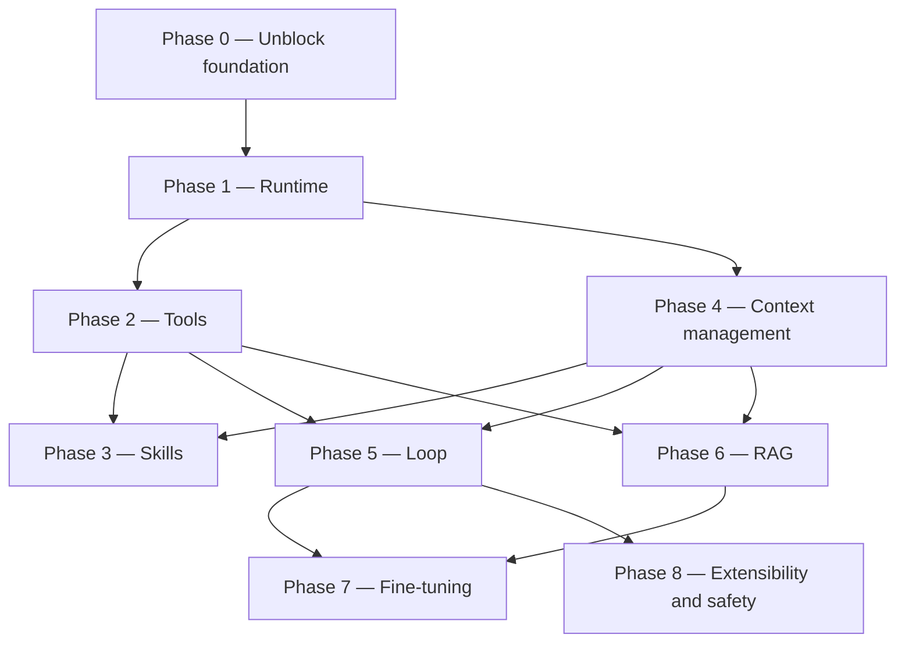

# ROADMAP.md — Catronaut agent system

Implementation roadmap for the remaining core pieces: **Runtime, Tools, Skills, Context, Loop,
RAG, Fine-tuning, Extensibility**. Milestones are sequential and numbered; dependencies are stated
per milestone.

Read [CLAUDE.md](CLAUDE.md) first — it records current state and conventions.

**Progress: Phase 0, Phase 1, and M2.1 are complete (2026-08-31).** The service boots, `/health`
reports the model backend, `POST /ui-ux/analyze` answers with a real `qwen3:4b` response, and the
`Tool`/`ToolRegistry` definition layer exists. Milestones are marked `[x]` as they land — keep this
file updated so other sessions don't redo finished work.

**Guiding constraints throughout:**

- Dev runs `qwen3:4b`, prod targets `qwen3.8-27b`. Wherever the gap changes a design decision, it
  is called out in a **[4B gap]** note.
- **This service sits behind an existing Go API gateway**, which owns public routing, versioning
  and JWT. No milestone below adds auth, rate limiting, CORS, or path versioning here — if a
  milestone seems to need one, it belongs in the gateway instead.
- **Terminology — "harness" is overloaded, and the collision matters.** Phase 1 is named
  **Runtime** precisely to avoid it: that phase is boot, config, lifecycle, run context, and
  observability, nothing more. In the wider agent literature "harness" means the *whole* agentic
  runtime — tools, skills, context management, the loop, hooks, permissions, sub-agents — which
  here is **Phases 2–5 plus Phase 8**. The agent harness proper begins at Phase 2.
  **Phase 1 being `[x]` does not mean the harness in that broader sense is done.** When a review
  or a milestone says "harness", check which sense is meant.

---

## Dependency overview



The three hard ordering rules:

- **Tool-call format (M2.1–M2.2) must be frozen before the loop is finalized (M5.2).**
  The loop's control flow *is* "did the model emit a valid tool call?" — you cannot write the
  termination and retry conditions until that answer has a stable shape.
- **The token budgeter (M4.1) must exist before RAG injection (M6.4).**
  Retrieval that cannot be told "you have 1,800 tokens" will silently blow the 4B's context.
- **Phase 8 must not start before the loop (Phase 5) is stable.** Its hook event set is derived
  from the loop's real seams; freeze it earlier and it will be the wrong set.

**Phase 3 (Skills) is numbered before Phase 4 but does not execute before it:** M3.2 needs the
budgeter and the assembly pipeline that Phase 4 builds. The number reflects where skills belong
conceptually — beside tools, as the second thing a domain agent is given — not the build order.
See "Suggested execution order".

---

## Phase 0 — Unblock the foundation — DONE (2026-08-29)

All four milestones landed. **Do not redo this phase.**

### [x] M0.1 — `app/core/config.py`
Shipped: pydantic-settings `Settings` + `settings` singleton + `get_settings()`.
Exposes `app_name, app_env, ollama_base_url, model_name, model_num_ctx, model_timeout_s,
model_think`, plus `is_dev` / `expose_raw_response` properties.
`.env.example` rewritten to match and `.env` seeded from it.
Postgres/Redis left commented out, pending a decision at M4.4.
**Gotcha for future edits:** `Settings` must keep `protected_namespaces=()` — pydantic v2 reserves
the `model_` prefix and this app deliberately uses `model_name` / `model_num_ctx`.

### [x] M0.2 — `app/core/model_provider/`
Shipped `base.py` (`ModelProvider` ABC) and `ollama_provider.py`.
The frozen signature is:
`async chat(messages, *, tools=None, think=None, **options) -> dict`, plus `aclose()`,
`extract_content(raw) -> str`, and `embed()` (raises `NotImplementedError`, see M6.3).
`OllamaProvider` uses a single shared `httpx.AsyncClient`, always sends `num_ctx` explicitly,
maps transport/status/timeout failures to `ProviderError`, and adds `health()` for `/health`.

**`extract_content` is not boilerplate — it encodes a measured model quirk.** See M0.5.

### [x] M0.3 — Dependencies and env hygiene
`requirements.txt` re-encoded UTF-8 and completed (`pydantic-settings`, `httpx`, `pytest`,
`pytest-asyncio`). `Dockerfile` written (host-Ollama note included). `.gitignore` reworked so
directory layout survives via `.gitkeep` while contents stay ignored. `__init__.py` added to every
package — the project no longer relies on implicit namespace packages.

### [x] M0.4 — Boot + smoke test
Service boots; `/health` returns `{"status":"ok","model_backend":"up","domains":["ui_ux"]}`.
`tests/test_api.py` (8 tests, model stubbed) passes. Live model checks live in
`scripts/smoke_test.py`, deliberately outside pytest because real generation takes minutes.

Also landed alongside Phase 0, ahead of schedule:
- **Error layer (part of M1.2):** `app/core/exceptions.py` — `CatronautError` tree and a handler
  returning `{"error": {"code", "message"}}`. `ProviderError` → 502, `UnknownDomainError` → 404.
  Verified in practice: a real model timeout returned a clean 502, not a 500 stack trace.
  *Retry is still outstanding — see M1.2.*
- **Declarative registry (M1.3):** `app/domains/registry.py`. Adding a domain no longer touches
  `app/core/`.
- **Routing flattened for the gateway:** `app/api/v1/` collapsed to `app/api/`, and routes are
  domain-relative (`POST /ui-ux/analyze`). The Go API gateway in front of this service owns
  public routing, versioning and JWT — this service must not duplicate them.

### [x] M0.5 — Model behaviour, measured

Tested directly against the running Ollama 0.33.1. These numbers drive real code and should not be
re-litigated from memory:

| Setting | Latency | Tokens | Outcome |
|---|---|---|---|
| `think: false` | 44s | 646 | `done_reason: stop`, complete answer |
| `think: true` | 105s | 900 | pure reasoning, cut off, **no answer** |
| `/no_think` suffix | 22s | 256 | reasoning only, cut off |

Conclusions now baked into the code:
- **`qwen3:4b` cannot be stopped from reasoning.** `think: false` only stops Ollama from splitting
  reasoning into `message.thinking`; the reasoning then leaks into `message.content` ending in a
  bare `</think>` with no opening tag. `OllamaProvider._LEAKED_THINK` strips it, with regression
  tests.
- **`MODEL_THINK=false` is the correct setting**, because it measurably shortens reasoning.
- **CPU-only inference at ~8 tok/s.** `MODEL_TIMEOUT_S` raised 300 → 600 after a real 300s timeout.
- **Do not cap `num_predict` tightly** — it truncates mid-reasoning and yields an empty answer.
- **`/api/embed` is unavailable** on this runner ("server does not support embeddings") → M6.3
  needs a dedicated embedding model.

---

## Phase 1 — Runtime (scaffolding, config, lifecycle)

Everything around the model call: how a request becomes a run, what a run carries, how it fails,
and how you see what happened.

**Renamed from "Harness" (2026-08-31)** to end the collision with the broader sense of that word.
This phase is scaffolding only — it makes a *service*, not an *agent*. The agent harness starts at
Phase 2. See the terminology note at the top of this file.

### [x] M1.1 — Model profiles — DONE (2026-08-30)

Shipped [app/core/model_profile.py](../app/core/model_profile.py): a frozen `ModelProfile`
dataclass (`name, context_window, supports_vision, supports_native_tools, tool_call_style
[native|prompt|none], reliability_tier [small|large]`) plus `get_model_profile(model_name)`,
keyed by exact Ollama tag. Registered: `qwen3:4b` and `qwen3:8b` (both `small`, no vision, no
native tools, prompt-style tool calling), `qwen3.8-27b` (`large`, vision, native tools). An
unregistered `model_name` falls back to a conservative default profile with a logged warning,
instead of guessing or crashing.

Wired in, not left dead:
- `Settings.model_profile` — a property on `settings`, so `settings.model_name` is still the one
  source of truth; nothing else needs to be kept in sync.
- `lifespan.py` logs the active tier on startup and **warns if `MODEL_NUM_CTX` exceeds the
  profile's `context_window`** — a real misconfiguration guard, not just informational.
- `GET /health` now reports `model_tier` and `supports_vision`, so tier is visible to whatever
  calls this service (the Go gateway, monitoring) without reading logs.
- `UIUXAgent` logs (does not block) when a request includes `image_base64` but the active
  profile has no vision support — diagnostic breadcrumb only; the field stays accepted on every
  model, matching the "vision stays optional and unblocking" decision in `CLAUDE.md`.

Deliberately NOT done here (belongs to later milestones that consume the profile, not this one):
`tool_call_style` and `supports_native_tools` are declared but unused until Phase 2 (M2.2 branches
tool-call parsing on this field). `reliability_tier` is unused until M5.3 (loop iteration caps per
tier). Do not wire those early — the profile's job in M1.1 was only to exist as a single source of
truth; consuming it for tools/loop belongs to those milestones.

**Depends on:** M0.2. ✅

### [x] M1.2 — Error handling and resilience — DONE (retry decided against, 2026-08-30)
- [x] Exception hierarchy (`CatronautError` → `ProviderError` / `UnknownDomainError` /
      `DomainError`) and a FastAPI handler mapping to 4xx/5xx.
- [x] Provider-level timeout, with transport/status/timeout failures mapped to `ProviderError`.
- [x] `extract_content` raises instead of silently returning `""` on a malformed response.
- [x] **Decided: no bounded retry here.** The Go gateway in front of this service already retries.
  Adding a second retry layer inside this service would stack on top of it — and a single call
  already takes 44s–600s on the dev CPU box, so stacked retries risk multi-minute worst-case
  latency for no real gain: a timeout or connection failure here usually means Ollama is
  overloaded or down, and an immediate retry doesn't fix that, only a backoff at the layer with
  visibility across all backends does (the gateway). Add `ToolError` when Phase 2 lands, still no
  retry.
**Depends on:** M0.2. ✅

### [x] M1.3 — Declarative domain registry — DONE
`app/domains/registry.py` holds `AGENT_REGISTRY`; `Orchestrator` is constructed with it from
`lifespan.py` and no longer imports any domain. Adding a domain is now: new folder under
`app/domains/`, one line in the registry, one router — `app/core/` untouched. Checklist documented
in README ("Adding a domain").

### [x] M1.4 — Run context object — DONE (2026-08-30)

Shipped [app/core/run_context.py](../app/core/run_context.py): a `RunContext` dataclass with
`run_id` (auto-generated, 12 hex chars), `domain`, `model_profile` (a snapshot from
`settings.model_profile` at run start), `session_id` (always `None` today — no session store
until M4.4), `created_at`, and three fields reserved for later milestones to write into without
another round of call-site changes: `token_budget` (M4.1), `steps` (M5.2 loop trace),
`tool_results` (M2.3).

Wired in, not left dead:
- `Agent._new_run_context()` and `Agent._build_output(run, raw, content)` on the base class
  ([app/core/agent_base.py](../app/core/agent_base.py)) — every agent creates one run per
  `handle()` call the same way.
- `UIUXAgent.handle` creates the run first thing, logs `run_id=... domain=... start` / `...done`,
  and includes `run.model_profile` in the vision-mismatch log line instead of re-reading settings.
- **`AgentOutput.run_id` is now part of the API response.** This is the concrete payoff: the
  caller (the Go gateway) gets a ID it can correlate against this service's logs when something
  goes wrong, without needing structured log shipping yet (that's still M1.5).

Deliberately NOT done here: no structured/JSON logging (M1.5), no session persistence (M4.4,
`session_id` stays `None`), nothing yet writes to `token_budget` / `steps` / `tool_results` —
those stay empty until the milestones that own them land.

**Depends on:** M1.1. ✅

### [x] M1.5 — Observability — DONE (2026-08-30), scoped to what has a consumer today

Shipped: `ModelProvider.extract_usage(raw) -> RunUsage` (`prompt_tokens`, `response_tokens`,
`duration_s`), implemented in `OllamaProvider` from Ollama's own `prompt_eval_count` /
`eval_count` / `total_duration`. Same reasoning as `extract_content`: these are Ollama-specific
field names, so the extraction lives in the provider, not in `agent_base.py` or `RunContext`
directly. `Agent._build_output` calls it, stores the result on `run.usage`, and logs one
structured "done" line per request: `run_id=... domain=... done prompt_tokens=... 
response_tokens=... duration_s=...`. Verified live against `qwen3:4b`.

**Deliberately deferred, not forgotten:**
- **Tool calls attempted/succeeded, truncation events** — can't be logged before Phase 2 (tools)
  and Phase 4 (context budgeting) exist to produce them. `RunContext.tool_results` /
  `token_budget` are already in place from M1.4 for those milestones to fill in; M1.5 doesn't
  need to touch them again.
- **JSONL persistence to `data/`** (the ROADMAP text called this optional) — skipped for now on
  purpose: there is no consumer for it yet. The first real consumer is M7.2 (fine-tuning data
  collection), which needs richer records anyway (full input/output, accept/edit/reject labels),
  not just token counts. Building a persistence layer now would mean guessing that shape twice.
  Revisit at M7.2 instead of building it speculatively here.
- **True structured (JSON) logging** — still plain-text `logging` with `key=value` tokens in the
  message, not a JSON formatter. Sufficient for grepping by `run_id` today; revisit only if log
  aggregation tooling is introduced.

**Depends on:** M1.4. ✅

---

## Phase 2 — Tools — the agent harness proper starts here

Phase 1 built a service that calls a model. From here on the phases build the thing the wider
literature calls the **agent harness**: what the model can invoke (Phase 2), what knowledge it is
given (Phase 3), what fits in its window (Phase 4), how many turns it gets (Phase 5), and what it
is allowed to do (Phase 8). Tools come first because every one of those depends on the tool-call
format being frozen.

### [x] M2.1 — Tool definition and registry — DONE (2026-08-31)

Shipped [app/core/tools/base.py](../app/core/tools/base.py): `Tool` ABC with `name`,
`description` (ClassVar), `args_schema: type[BaseModel]`, `async run(self, args: BaseModel) ->
Any`. `run()` always receives an already-validated `args_schema` instance — a `Tool` subclass
never sees raw model output; that extraction/validation/repair layer is M2.2, not this milestone.

Shipped [app/core/tools/registry.py](../app/core/tools/registry.py): `ToolRegistry(tools)` —
raises `ValueError` on a duplicate `name` at construction time, `.get(name)` resolves a tool
(`None` if unknown), `.schema()` returns a backend-agnostic
`[{name, description, parameters}]` list (`parameters` from `args_schema.model_json_schema()`)
for both the native path (Ollama `tools` param) and the prompt-based fallback (M2.2) to read.
`__len__`/`__iter__` for allowlisting/capping checks in M2.3/M2.4.

Scope deliberately narrow: no concrete tools yet (that's M2.4), no
`app/domains/<domain>/tools/` directory created yet either — empty scaffolding with nothing to
put in it. Not wired into `Agent`/`Orchestrator`/`RunContext` yet; `RunContext.tool_results` (from
M1.4) stays the landing spot once M2.3 exists to fill it. Tests in
[tests/test_tools.py](../tests/test_tools.py): resolve-by-name, schema shape, duplicate-name
rejection, `__len__`/`__iter__`, and `run()` on validated args (5 tests, all stub tools — no model
calls).

**Depends on:** M1.1. ✅
**[4B gap]** Still applies to whoever writes the *first real* tool at M2.4: flat args (no nested
objects), ≤3 params, enums over free strings, `snake_case` verb-noun names, one-line descriptions.
Cap the exposed tool count at ~3–5 per domain in dev — the 4B's selection accuracy falls off
sharply beyond that. Nothing about `Tool`/`ToolRegistry` itself enforces this; it's a convention
for whatever populates the registry.

### M2.2 — Tool-call parsing, validation, repair
The critical layer. Two paths, chosen by `ModelProfile.tool_call_style`:
- **native** (27B): use Ollama's `tools` parameter, read `message.tool_calls`.
- **prompt-based fallback** (4B): instruct a strict JSON envelope, extract with a tolerant parser
  (strip fences, take the first balanced object), validate against `args_schema`.

On validation failure: exactly **one** bounded repair turn feeding the validation error back, then
give up and surface a structured failure. Never loop repairs.
**Depends on:** M2.1. **Blocks M5.2 — freeze this format before writing the loop.**
**[4B gap]** This whole milestone exists because of the 4B. Design the fallback path first and
verify it on `qwen3:4b`; treat the 27B's native path as the optimization, not the baseline.

### M2.3 — Execution policy
Timeouts per tool, result-size truncation before the result re-enters context, a read-only vs
side-effecting classification, and an allowlist per domain.
**Depends on:** M2.2.
**[4B gap]** Result truncation is a context-budget concern, not a nicety: one untruncated tool
result can consume the 4B's entire remaining window.

### M2.4 — First real tool pack for `ui_ux`
Concrete, small, useful. Suggested starting set: a contrast/a11y checker, a design-token/heuristic
lookup (later backed by RAG in M6.4), and a structured-report formatter.
**Depends on:** M2.3, and benefits from M6.4 for the lookup tool.

---

## Phase 3 — Skills

A **skill** is a named bundle of domain knowledge expressed as *prompt text* — checklists,
condensed rule digests, worked examples, output-format contracts. It is not callable.

Three things must stay distinct, because they are selected by different mechanisms and compete for
the same window:

| | Selected by | Content | Budget slot |
|---|---|---|---|
| **Tool** (Phase 2) | the model, at run time | a callable | schema only |
| **Skill** (Phase 3) | a rule, before the call | curated static text | its own |
| **Retrieved context** (M6.4) | embedding distance, at query time | indexed chunks | its own |

This phase builds the **loading and selection mechanism only**. Skill *content* is sourced from
existing public material (WCAG digests, design-system checklists, usability heuristics) and dropped
in — authoring content is not part of any milestone here and must never block one.

### M3.1 — Skill definition and loading mechanism
- On disk: `app/domains/<domain>/skills/<name>.md`, shared ones in `app/core/skills/`.
  Frontmatter: `name`, `description`, `triggers`, `token_estimate`.
- `Skill` dataclass + `SkillRegistry` under `app/core/skills/` — deliberately mirrors
  `ToolRegistry` (M2.1): `get(name)`, duplicate-name rejection at construction, built once at
  startup in `lifespan.py`, never re-read per request.
- Frontmatter is validated at load time: a malformed skill fails startup loudly rather than
  silently injecting nothing.
**Depends on:** M2.1 (the registry shape it mirrors), M1.3 (per-domain wiring).
**[4B gap]** `token_estimate` is mandatory metadata, not decoration: on the 4B a single 800-token
skill outweighs the user's actual input. Keep skills ≤300 tokens for the `small` tier; a longer
variant may be gated to `large`.

### M3.2 — Conditional skill injection
Decides *which* skills enter a run and *where*. A per-domain `SkillSelector`: rule/keyword match on
the input plus an explicit `AgentInput.skills` override, capped by count and by the token slot M4.1
allocates. Injected by M4.2's assembly pipeline into a dedicated slot — after the system prompt,
before retrieved context — and recorded on `RunContext` so M1.5's "done" line reports which skills
fired.

**Skills and retrieved context must never share a budget slot.** One slot means a retrieval-heavy
run silently evicts the output-format contract, and the failure then looks like the model
"forgetting" its format.
**Depends on:** M3.1, M4.1, M4.2. **Executes after Phase 4, despite the number.**
**[4B gap]** Cap at 1–2 skills on `small`, 3–5 on `large`. Selection is rule-based — do not ask the
4B which skills it needs.

### M3.3 — Tool packs (built-in skills)
A `ToolPack`: a named, enable-flagged bundle of tools that ship together for one recurring task
(e.g. `a11y_audit` = contrast checker + token lookup + report formatter), carrying the skill (M3.1)
that teaches their use. A domain enables packs by name; `ToolRegistry` is built from the enabled
packs rather than from ad-hoc registration.

This is the taxonomy's "built-in skills": a pre-packaged capability for a recurring task, as
opposed to registering loose tools one by one.
**Do not build this before M2.4 exists** — generalize from one real pack, not ahead of it.
**Depends on:** M2.4, M3.1.
**[4B gap]** The pack is where the ~3–5 tool cap gets enforced: a pack exceeding the active
profile's cap fails at startup, instead of silently degrading the 4B's tool selection.

---

## Phase 4 — Context management

### M4.1 — Token budgeter
A single component that owns the window: counts tokens (via Ollama, or a tokenizer approximation
with a safety margin), and allocates a budget — system, retrieved context, history, tool results,
reserved output. Budgets come from `ModelProfile.context_window`, so the dev/prod difference is
one config value.
**Depends on:** M1.1. **Blocks M6.4.**
**[4B gap]** This is where prod-vs-dev is most visible. On the 27B you can be generous; on the 4B
every section is competing. Build and tune against the 4B numbers.

### M4.2 — Message assembly pipeline
A deterministic builder producing the final message list in a fixed order:
`system → (retrieved context) → (summarized history) → recent turns → current input → tool results`.
Replaces the ad-hoc list building in `UIUXAgent.handle`. Same order every time, so failures are
reproducible.
**Depends on:** M4.1.

### M4.3 — Truncation and compaction strategy
When over budget, in order: (1) drop oldest tool results, (2) drop oldest turns, (3) summarize the
dropped turns into one rolling summary message, (4) hard-trim retrieved context. Always log which
step fired.
**Depends on:** M4.2.
**[4B gap]** Summarization is itself a model call, and the 4B summarizes poorly. In dev prefer
straight dropping with an explicit "[earlier turns omitted]" marker; enable summarization on the
27B profile.

### M4.4 — Session / conversation store
Persist conversations by `session_id` (in-memory first, Redis or SQLite later — this is where the
`.env.example` `REDIS_URL` question gets answered). `AgentInput` gains an optional `session_id`.
**Depends on:** M4.2.

---

## Phase 5 — Loop

**Recommendation: bounded ReAct, with iteration limits driven by the model profile.**

Rationale — single-step is too weak once tools exist, and multi-turn planning (plan → execute →
replan) is not realistic on a 4B: it cannot hold a plan and revise it reliably within a small
context. Bounded ReAct is the only pattern that degrades gracefully across both models. It is the
same code path on both; only `max_iterations` and the tool-call style change.

### M5.1 — Single-step baseline
Formalize what exists today: system + user → one model call → response. Keep it as an explicit
`SingleStepLoop` strategy, used for domains that need no tools and as the fallback when the loop
aborts.
**Depends on:** M4.2.

### M5.2 — Bounded ReAct loop
`while iterations < max: call model → parse (M2.2) → if tool call: execute (M2.3), append result,
continue → else: return`. Hard iteration cap, a per-run wall-clock cap, and repeated-identical-call
detection (a small model's favorite failure is calling the same tool with the same args forever).
Every iteration re-runs the budgeter (M4.1) before calling.
**Depends on:** M2.2 (format frozen) and M4.1. **This is the phase's core milestone.**
**[4B gap]** `max_iterations`: 2–3 on the 4B, 6–8 on the 27B. Also make "no tool call emitted"
a *valid terminal state* rather than an error — the 4B often answers directly when it should have
called a tool, and that should return a usable answer, not a 500.

### M5.3 — Loop policy per profile
Move iteration caps, whether `think` is enabled, and which strategy runs into the `ModelProfile`.
One switch flips dev↔prod behavior.
**Depends on:** M5.2.

### M5.4 — Optional planner (prod only)
A plan-then-execute strategy for the 27B on multi-part UI/UX audits. Gate strictly behind
`reliability_tier == "large"`; do not attempt to make it work on the 4B.
**Depends on:** M5.3, M1.5 (you need metrics to prove it's better).

---

## Phase 6 — RAG

Purpose for `ui_ux`: ground feedback in *actual* guidelines rather than model recall — WCAG rules,
design-system tokens, component conventions, past review decisions.

### M6.1 — Corpus definition
Decide and write down exactly what gets indexed. Proposed for `ui_ux`:
1. Accessibility guidelines (WCAG success criteria, condensed).
2. The target design system: tokens, spacing scale, typography, component do/don't rules.
3. Internal UI/UX heuristics and review checklists.
4. Curated past reviews (input → accepted feedback) — doubles as fine-tuning data (M7.2).

Corpora are **per-domain and namespaced**: `data/raw/<domain>/`, `data/processed/<domain>/`,
`data/vectorstore/<domain>/`. Retrieval never crosses domains by default.
**Depends on:** nothing (can be drafted in parallel with Phase 0–1).

### M6.2 — Ingestion and chunking
A script under `scripts/` : load → normalize → chunk → write to `data/processed/<domain>/` with
metadata (`source`, `section`, `domain`, `rule_id`).
**Depends on:** M6.1.
**[4B gap]** Chunk small — target ~200–350 tokens. On the 4B you can afford maybe 2–3 chunks in
context; large chunks mean either one chunk of coverage or an overflow.

### M6.3 — Embeddings and vector store
Implement `ModelProvider.embed` (declared in M0.2) against a local Ollama embedding model. Store
in a local vector DB (Chroma or FAISS) under `data/vectorstore/<domain>/`. Index built by script,
loaded read-only at startup via lifespan.
**Depends on:** M6.2, M0.2.

### M6.4 — Retrieval integrated into the domain
Two integration shapes; **do both, profile-gated**:
- **Pre-fetch (dev / 4B default):** retrieve once from the user input before the first model call
  and inject into the context slot allocated by M4.1. Deterministic, costs no tool-calling ability.
- **Retriever-as-tool (prod / 27B):** expose `search_guidelines` via the tool registry so the model
  decides when to retrieve, inside the ReAct loop.

Retrieval lives in `app/core/memory/` (shared machinery), configured per domain by namespace —
matching the README's "shared RAG layer across domains".
**Depends on:** M6.3, M4.1, and M2.1 for the tool variant.
**[4B gap]** This split is the clearest example of designing around the gap: the 4B gets guaranteed
context it didn't have to ask for; the 27B gets agency.

### M6.5 — Retrieval quality pass
Add a reranking step (or hybrid keyword + vector) and a small retrieval eval set under
`evaluation/datasets/ui_ux/` : query → expected source chunks. Measure recall@k before touching
generation quality.
**Depends on:** M6.4.

---

## Phase 7 — Fine-tuning (UI/UX domain)

The folder layout already anticipates this: `models/adapters/<domain>/` and
`evaluation/datasets/<domain>/`. The plan is **one LoRA adapter per domain**, over one shared base.

### M7.1 — Evaluation harness FIRST
`evaluation/scripts/` : run a dataset of UI/UX inputs through the live agent, score with a rubric
(structure, actionability, correct a11y references, format compliance), write to
`evaluation/results/`. Establish baselines for `qwen3:4b` and the 27B *before* any tuning.
**Depends on:** M5.2. **Blocks M7.4 — without a baseline you cannot tell if fine-tuning helped.**

### M7.2 — Data collection
Log every run (M1.5) in a training-ready shape: input, retrieved context, tool calls, final output,
plus a human accept/edit/reject label. This turns normal usage into a dataset.
**Depends on:** M1.5.

### M7.3 — Dataset construction
Build `data/processed/ui_ux/sft.jsonl` in chat format. Two target behaviors, roughly 60/40:
1. **Response quality** — well-structured, correctly grounded UI/UX critique.
2. **Format compliance** — emitting valid tool calls in the exact envelope from M2.2.

Target a few hundred to ~2k high-quality examples; curation beats volume at this scale.
**Depends on:** M7.2, M2.2 (the tool format must be frozen or you train on a format you'll change).
**[4B gap]** Behavior (2) is where fine-tuning pays off most for the small model. A 4B fine-tuned
on your exact tool envelope can approach the 27B's zero-shot format reliability — this is the
highest-leverage item in the phase.

### M7.4 — LoRA training run
Train on the 4B first (fast, cheap, fits on one consumer GPU) to validate the whole pipeline.
Rank 8–16, target attention projections, hold out ~10% for eval. Adapter to
`models/adapters/ui_ux/`.
**Depends on:** M7.3, M7.1.

### M7.5 — Serving the adapter via Ollama
Merge the adapter (or reference it), convert to GGUF, write a `Modelfile` under `configs/`,
`ollama create catronaut-ui-ux`. It then becomes just another `model_name` in settings — no
application code changes.
**Depends on:** M7.4.

### M7.6 — Per-domain adapter routing
When `code_review` arrives: each domain declares its adapter/model name; the orchestrator resolves
the right provider per domain. Decide then between multiple loaded models (VRAM cost) and hot
adapter swapping (latency cost) — measure before choosing.
**Depends on:** M7.5, M1.3.

---

## Phase 8 — Extensibility and safety

Nothing here is new behavior. It is a **seam** for behavior that already exists (M1.5) or is
already planned hardcoded inside M1.2 / M2.3 / M4.3. Do not start this phase before Phase 5 is
stable: an event set frozen before the loop exists will be the wrong event set.

### M8.1 — Lifecycle hooks / event system
`app/core/hooks.py`: a `HookBus` built once in `lifespan.py` and injected the way the model
provider is — **never a module-level global** (CLAUDE.md §2, invariant #1).

Closed event set; every event has a real consumer today or in this ROADMAP:

| Event | Payload | Short-circuit | Absorbs |
|---|---|---|---|
| `run_start` | `RunContext`, `messages` | no (may mutate messages) | — |
| `pre_tool_call` | `RunContext`, `tool_name`, validated `args` | **yes** — `Deny(reason)` / `ReplaceArgs` | M2.3 allowlist, M8.2 |
| `post_tool_call` | `RunContext`, `tool_name`, `args`, `result` | no (may replace result) | M2.3 truncation |
| `on_compaction` | `RunContext`, `strategy`, `tokens_before/after` | no | M4.3's "log which step fired" |
| `on_error` | `RunContext`, exception | no — **never swallows** | M1.2 handler stays as-is |
| `run_end` | `RunContext`, `AgentOutput` | no | M1.5 "done" line, M7.2 collection |

Rules: hooks are `async def` and run in registration order; an exception *inside* a hook is caught
and logged and never aborts the run — a `Deny` is the only intentional stop. Only `pre_tool_call`
can short-circuit, and a denial becomes a structured tool *result* fed back to the model, not an
exception, so the loop can recover from it.

**Nothing already shipped gets redone:** M1.5's "done" line stays where it is and is simply
registered as the default `run_end` hook; `_build_output`'s signature does not change.
**Depends on:** M2.3, M4.3, M5.2 (freeze the event set only once the loop's real seams exist).
**[4B gap]** A denial reason re-enters the 4B's context as a tool result — keep it to one line, and
count denied calls against M5.2's iteration cap: a 4B will retry the same denied call verbatim.

### M8.2 — Permission layer (formalizes M2.3; no sandbox)
Each `Tool` declares its capability surface as class metadata: `read_only: bool` and
`capabilities: frozenset` over `{"fs_read", "fs_write", "network", "subprocess"}` (empty = pure
computation). Each domain declares what it permits. Enforcement happens in exactly one place —
`pre_tool_call` (M8.1) — so there is a single deny path, logged with `run_id`.

**This is not duplicating the gateway.** CLAUDE.md §1 gives the gateway user authn/authz; this
layer governs what the *model* may invoke inside a run, which the gateway cannot see. Different
concern — do not delete this citing §1.

**Assessment of M2.4's tool pack (2026-08-31):** contrast/a11y checker = pure computation on args;
design-token lookup = read-only, in-process, query-string arg (**never a path**); report formatter
= pure string work. None executes code, resolves a path, or makes an outbound request →
**declaration plus allowlist is sufficient; no sandbox is needed for that pack.**
**Depends on:** M2.3, M8.1.

### M8.3 — Sandboxing — conditional; do not build until a trigger fires
Build only when one of these actually lands. Each is a real escalation, not a hypothetical:
1. `code_review` running a linter, formatter, or test suite on submitted code → a subprocess over
   untrusted input. Needs process isolation, wall-clock and memory caps, no network, non-root, and
   a read-only copy of the input.
2. Any tool taking a filesystem path from model output — the 4B hallucinates paths, which makes
   traversal reachable.
3. Any tool making an outbound request to a model-supplied URL. Blast radius matters here: per
   CLAUDE.md §1 this service sits on a trusted internal network, so an SSRF reaches internal
   services, not just the internet.
4. Any tool writing to `data/` or mutating the vector store (M6.3).

Until one of those exists, sandboxing is dead weight. **This is a decision, not an open question.**
**Depends on:** M8.2.

### M8.4 — Sub-agents — the last milestone
Deliberately the most advanced item in this ROADMAP, and deliberately last: a sub-agent multiplies
every weakness of the loop, the budgeter, and the permission layer, so all three must be stable on
a single domain first.

A sub-agent is a nested run with its own context, its own tool set, and its own budget — **not** a
copy of the parent's. Non-negotiable constraints:

- **Context is rebuilt, never inherited.** The child receives a purpose-written task brief the
  parent composes through M4.2; it never receives the parent's message list.
- **Scope is a subset, declared at spawn.** The child's `ToolRegistry` (M2.1) and permission set
  (M8.2) are narrower than the parent's; a child can never widen what the parent held.
- **Results return as structured summaries, never transcripts.** Dumping a child transcript into
  the parent defeats the entire point — context isolation — and blows the budget.
- **The child's budget counts against the parent's ceiling**, tracked on the parent `RunContext`
  (`steps`, from M1.4); otherwise a runaway parent spawns runaway children.
- **Depth 1 only.** No sub-agent spawns a sub-agent until there is a measured reason.

**Depends on:** M5.3 (the loop stable and profile-gated on one domain first), M8.1, M8.2, M4.1.
**[4B gap]** Almost certainly **prod/27B only**, like M5.4: the 4B cannot decompose a task, write a
child brief, and integrate a structured result reliably. Gate behind `reliability_tier == "large"`
and do not spend dev time making it work on the 4B.

---

## Suggested execution order

**Phase numbers are conceptual; this block is the build order.** Phase 3 (Skills) is the one place
they diverge — see the note under "Dependency overview".

```
[x] M0.1 → M0.2 → M0.3 → M0.4 → M0.5   (service boots — DONE)
[x] M1.1 → M1.2 → M1.3 → M1.4 → M1.5    (Phase 1: runtime — DONE. M1.2 retry skipped by decision;
                                          M1.5's JSONL persistence deferred to M7.2 by decision)
[x] M2.1 → M2.2 → M2.3                  (tool format frozen — hard gate for the loop. M2.1 DONE)
    M4.1 → M4.2 → M4.3 → M4.4           (context budget)
    M5.1 → M5.2 → M5.3                  (loop; M5.4 optional, prod only)
    M6.1 → M6.2 → M6.3 → M6.4 → M6.5    (RAG)  [M6.1 can start early, in parallel]
    M3.1 → M3.2                         (skills; M3.2 needs M4.1 + M4.2, so after Phase 4)
    M2.4 lands after M6.4.
    M3.3 lands after M2.4 (tool packs generalize from one real pack)
    M7.1 → M7.2 → M7.3 → M7.4 → M7.5 → M7.6   (fine-tuning)
    M8.1 → M8.2 → [M8.3 only if a trigger fires] → M8.4   (hooks, permissions, sub-agents LAST)
```

**Phase 1 (Runtime) is fully done. M2.1 (tool definitions and registry) is also done.** Next up:
**M2.2 (tool-call parsing, validation, repair)** — the milestone with a hard downstream gate: its
tool-call parsing style must be frozen before M5.2 (the loop) can be finalized, so get the tool
schema shape right before building much on top of it. Verify every tool schema decision against
`qwen3:4b` (prompt-style tool calling, per its `ModelProfile`) — the 27B's native tool calling is
the easy case.

**M3.1 (skill loading) is the one item that can be picked up out of order** — it depends only on
M2.1 and M1.3, both done, and it is a self-contained registry. Useful if Phase 4 stalls.

**Decisions settled (2026-08-29) — do not re-ask:**
- **Prod model tag: `qwen3.8-27b`.** Verified the same day: it 404s from the public Ollama library,
  so it needs a Modelfile or a private registry on the GPU server. Nothing hardcodes it; it is set
  through `MODEL_NAME`. M1.1 builds its `large` profile around this tag.
- **Postgres: later**, on the GPU server; a Neon URL is the likely first form. Stays commented in
  `.env.example` until M4.4 needs it.
- **Vision: stays optional and non-blocking.** Revisit only once the real 27B runs on prod — do not
  spend dev time on a local VL model before then.

**Decisions settled (2026-08-31) — do not re-ask:**
- **Phase structure was audited against a 9-component agent-harness taxonomy** (loop, context,
  skills/tools, sub-agents, built-in skills, session persistence, prompt assembly, lifecycle hooks,
  permissions). Result: the loop and context phases already covered their components properly;
  skills, sub-agents, hooks, and a real permission layer did not exist and are now Phase 3 and
  Phase 8. Phase 1 was renamed Runtime, and Phases 3–6 were renumbered to 4–7 to open the slot.
  **The renumber touched no shipped code identifiers** — everything built so far lives in M0/M1/M2,
  which kept their numbers — so git history and commit messages remain accurate.
- **No sandbox for the `ui_ux` tool pack.** See M8.2's assessment and M8.3's trigger list.
- **Sub-agents are last (M8.4), not early.** Isolated rebuilt context, subset permissions, and
  structured-summary returns are the constraints that make them expensive; the loop must be stable
  on one domain first.

**Still open:**
- An embedding model for RAG — `/api/embed` is unavailable on the current runner (needed by M6.3).
- **System prompt composition has no owner.** M4.2 owns *message ordering*; nothing owns how the
  system prompt itself is composed from its fragments — the base domain prompt, M2.2's tool-call
  envelope instructions (needed on the 4B's prompt path), M3.2's skill fragments, and M5.3's
  profile-conditional bits all write into it. Assign this before M3.2, or CLAUDE.md §3's "keep
  system prompts short and imperative" gets violated by accretion.
- **Session persistence is scoped to conversation history only** (M4.4). Resuming an interrupted
  run — loop state, partial tool results — is covered nowhere; M7.2 logs runs for training, not for
  resume. Decide whether that matters given a single call already takes 44s–600s.

---

## Keeping this file honest

Every change that lands must update this file **in the same commit as the code**:

1. Mark the milestone `[x]`, or `PARTIALLY DONE` with the remaining bullets still `[ ]`.
2. Write what actually shipped: file names, frozen signatures, measured numbers.
3. Move settled questions out of "Still open" into "Decisions settled".
4. Update the STATUS block at the top of `CLAUDE.md` — what is done, what is next, what must not
   be redone.
5. English only. No bilingual sections.
