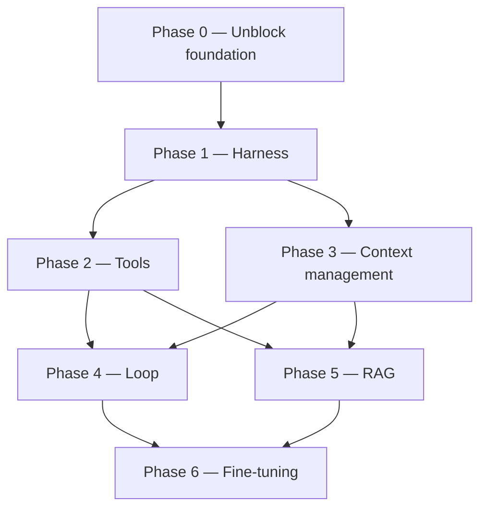

# ROADMAP.md — Catronaut agent system

Implementation roadmap for the remaining core pieces: **Harness, Tools, Context, Loop, RAG,
Fine-tuning**. Milestones are sequential and numbered; dependencies are stated per milestone.

Read [CLAUDE.md](CLAUDE.md) first — it records current state and conventions.

**Progress: Phase 0 is complete (2026-08-29).** The service boots, `/health` reports the model
backend, and `POST /ui-ux/analyze` answers with a real `qwen3:4b` response. Phase 1 is the
next thing to pick up. Milestones are marked `[x]` as they land — keep this file updated so other
sessions don't redo finished work.

**Guiding constraints throughout:**

- Dev runs `qwen3:4b`, prod targets `qwen3.8-27b`. Wherever the gap changes a design decision, it
  is called out in a **[4B gap]** note.
- **This service sits behind an existing Go API gateway**, which owns public routing, versioning
  and JWT. No milestone below adds auth, rate limiting, CORS, or path versioning here — if a
  milestone seems to need one, it belongs in the gateway instead.

---

## Dependency overview



The two hard ordering rules:

- **Tool-call format (M2.1–M2.2) must be frozen before the loop is finalized (M4.2).**
  The loop's control flow *is* "did the model emit a valid tool call?" — you cannot write the
  termination and retry conditions until that answer has a stable shape.
- **The token budgeter (M3.1) must exist before RAG injection (M5.4).**
  Retrieval that cannot be told "you have 1,800 tokens" will silently blow the 4B's context.

---

## Phase 0 — Unblock the foundation — DONE (2026-08-29)

All four milestones landed. **Do not redo this phase.**

### [x] M0.1 — `app/core/config.py`
Shipped: pydantic-settings `Settings` + `settings` singleton + `get_settings()`.
Exposes `app_name, app_env, ollama_base_url, model_name, model_num_ctx, model_timeout_s,
model_think`, plus `is_dev` / `expose_raw_response` properties.
`.env.example` rewritten to match and `.env` seeded from it.
Postgres/Redis left commented out, pending a decision at M3.4.
**Gotcha for future edits:** `Settings` must keep `protected_namespaces=()` — pydantic v2 reserves
the `model_` prefix and this app deliberately uses `model_name` / `model_num_ctx`.

### [x] M0.2 — `app/core/model_provider/`
Shipped `base.py` (`ModelProvider` ABC) and `ollama_provider.py`.
The frozen signature is:
`async chat(messages, *, tools=None, think=None, **options) -> dict`, plus `aclose()`,
`extract_content(raw) -> str`, and `embed()` (raises `NotImplementedError`, see M5.3).
`OllamaProvider` uses a single shared `httpx.AsyncClient`, always sends `num_ctx` explicitly,
maps transport/status/timeout failures to `ProviderError`, and adds `health()` for `/health`.

**`extract_content` is not boilerplate — it encodes a measured model quirk.** See M0.5.

### [x] M0.3 — Dependencies and env hygiene
`requirements.txt` re-encoded UTF-8 and completed (`pydantic-settings`, `httpx`, `pytest`,
`pytest-asyncio`). `Dockerfile` written (host-Ollama note included). `.gitignore` reworked so
directory layout survives via `.gitkeep` while contents stay ignored. `__init__.py` added to every
package — the project no longer relies on implicit namespace packages.

### [x] M0.4 — Boot + smoke test
Service boots; `/health` returns `{"status":"ok","model_backend":"up","domains":["ui_ux"]}`.
`tests/test_api.py` (8 tests, model stubbed) passes. Live model checks live in
`scripts/smoke_test.py`, deliberately outside pytest because real generation takes minutes.

Also landed alongside Phase 0, ahead of schedule:
- **Error layer (part of M1.2):** `app/core/exceptions.py` — `CatronautError` tree and a handler
  returning `{"error": {"code", "message"}}`. `ProviderError` → 502, `UnknownDomainError` → 404.
  Verified in practice: a real model timeout returned a clean 502, not a 500 stack trace.
  *Retry is still outstanding — see M1.2.*
- **Declarative registry (M1.3):** `app/domains/registry.py`. Adding a domain no longer touches
  `app/core/`.
- **Routing flattened for the gateway:** `app/api/v1/` collapsed to `app/api/`, and routes are
  domain-relative (`POST /ui-ux/analyze`). The Go API gateway in front of this service owns
  public routing, versioning and JWT — this service must not duplicate them.

### [x] M0.5 — Model behaviour, measured

Tested directly against the running Ollama 0.33.1. These numbers drive real code and should not be
re-litigated from memory:

| Setting | Latency | Tokens | Outcome |
|---|---|---|---|
| `think: false` | 44s | 646 | `done_reason: stop`, complete answer |
| `think: true` | 105s | 900 | pure reasoning, cut off, **no answer** |
| `/no_think` suffix | 22s | 256 | reasoning only, cut off |

Conclusions now baked into the code:
- **`qwen3:4b` cannot be stopped from reasoning.** `think: false` only stops Ollama from splitting
  reasoning into `message.thinking`; the reasoning then leaks into `message.content` ending in a
  bare `</think>` with no opening tag. `OllamaProvider._LEAKED_THINK` strips it, with regression
  tests.
- **`MODEL_THINK=false` is the correct setting**, because it measurably shortens reasoning.
- **CPU-only inference at ~8 tok/s.** `MODEL_TIMEOUT_S` raised 300 → 600 after a real 300s timeout.
- **Do not cap `num_predict` tightly** — it truncates mid-reasoning and yields an empty answer.
- **`/api/embed` is unavailable** on this runner ("server does not support embeddings") → M5.3
  needs a dedicated embedding model.

---

## Phase 1 — Harness (runtime scaffolding, config, lifecycle)

The harness is everything around the model call: how a request becomes a run, what a run carries,
how it fails, and how you see what happened.

### [x] M1.1 — Model profiles — DONE (2026-08-30)

Shipped [app/core/model_profile.py](../app/core/model_profile.py): a frozen `ModelProfile`
dataclass (`name, context_window, supports_vision, supports_native_tools, tool_call_style
[native|prompt|none], reliability_tier [small|large]`) plus `get_model_profile(model_name)`,
keyed by exact Ollama tag. Registered: `qwen3:4b` and `qwen3:8b` (both `small`, no vision, no
native tools, prompt-style tool calling), `qwen3.8-27b` (`large`, vision, native tools). An
unregistered `model_name` falls back to a conservative default profile with a logged warning,
instead of guessing or crashing.

Wired in, not left dead:
- `Settings.model_profile` — a property on `settings`, so `settings.model_name` is still the one
  source of truth; nothing else needs to be kept in sync.
- `lifespan.py` logs the active tier on startup and **warns if `MODEL_NUM_CTX` exceeds the
  profile's `context_window`** — a real misconfiguration guard, not just informational.
- `GET /health` now reports `model_tier` and `supports_vision`, so tier is visible to whatever
  calls this service (the Go gateway, monitoring) without reading logs.
- `UIUXAgent` logs (does not block) when a request includes `image_base64` but the active
  profile has no vision support — diagnostic breadcrumb only; the field stays accepted on every
  model, matching the "vision stays optional and unblocking" decision in `CLAUDE.md`.

Deliberately NOT done here (belongs to later milestones that consume the profile, not this one):
`tool_call_style` and `supports_native_tools` are declared but unused until Phase 2 (M2.2 branches
tool-call parsing on this field). `reliability_tier` is unused until M4.3 (loop iteration caps per
tier). Do not wire those early — the profile's job in M1.1 was only to exist as a single source of
truth; consuming it for tools/loop belongs to those milestones.

**Depends on:** M0.2. ✅

### [x] M1.2 — Error handling and resilience — DONE (retry decided against, 2026-08-30)
- [x] Exception hierarchy (`CatronautError` → `ProviderError` / `UnknownDomainError` /
      `DomainError`) and a FastAPI handler mapping to 4xx/5xx.
- [x] Provider-level timeout, with transport/status/timeout failures mapped to `ProviderError`.
- [x] `extract_content` raises instead of silently returning `""` on a malformed response.
- [x] **Decided: no bounded retry here.** The Go gateway in front of this service already retries.
  Adding a second retry layer inside this service would stack on top of it — and a single call
  already takes 44s–600s on the dev CPU box, so stacked retries risk multi-minute worst-case
  latency for no real gain: a timeout or connection failure here usually means Ollama is
  overloaded or down, and an immediate retry doesn't fix that, only a backoff at the layer with
  visibility across all backends does (the gateway). Add `ToolError` when Phase 2 lands, still no
  retry.
**Depends on:** M0.2. ✅

### [x] M1.3 — Declarative domain registry — DONE
`app/domains/registry.py` holds `AGENT_REGISTRY`; `Orchestrator` is constructed with it from
`lifespan.py` and no longer imports any domain. Adding a domain is now: new folder under
`app/domains/`, one line in the registry, one router — `app/core/` untouched. Checklist documented
in README ("Adding a domain").

### [x] M1.4 — Run context object — DONE (2026-08-30)

Shipped [app/core/run_context.py](../app/core/run_context.py): a `RunContext` dataclass with
`run_id` (auto-generated, 12 hex chars), `domain`, `model_profile` (a snapshot from
`settings.model_profile` at run start), `session_id` (always `None` today — no session store
until M3.4), `created_at`, and three fields reserved for later milestones to write into without
another round of call-site changes: `token_budget` (M3.1), `steps` (M4.2 loop trace),
`tool_results` (M2.3).

Wired in, not left dead:
- `Agent._new_run_context()` and `Agent._build_output(run, raw, content)` on the base class
  ([app/core/agent_base.py](../app/core/agent_base.py)) — every agent creates one run per
  `handle()` call the same way.
- `UIUXAgent.handle` creates the run first thing, logs `run_id=... domain=... start` / `...done`,
  and includes `run.model_profile` in the vision-mismatch log line instead of re-reading settings.
- **`AgentOutput.run_id` is now part of the API response.** This is the concrete payoff: the
  caller (the Go gateway) gets a ID it can correlate against this service's logs when something
  goes wrong, without needing structured log shipping yet (that's still M1.5).

Deliberately NOT done here: no structured/JSON logging (M1.5), no session persistence (M3.4,
`session_id` stays `None`), nothing yet writes to `token_budget` / `steps` / `tool_results` —
those stay empty until the milestones that own them land.

**Depends on:** M1.1. ✅

### [x] M1.5 — Observability — DONE (2026-08-30), scoped to what has a consumer today

Shipped: `ModelProvider.extract_usage(raw) -> RunUsage` (`prompt_tokens`, `response_tokens`,
`duration_s`), implemented in `OllamaProvider` from Ollama's own `prompt_eval_count` /
`eval_count` / `total_duration`. Same reasoning as `extract_content`: these are Ollama-specific
field names, so the extraction lives in the provider, not in `agent_base.py` or `RunContext`
directly. `Agent._build_output` calls it, stores the result on `run.usage`, and logs one
structured "done" line per request: `run_id=... domain=... done prompt_tokens=... 
response_tokens=... duration_s=...`. Verified live against `qwen3:4b`.

**Deliberately deferred, not forgotten:**
- **Tool calls attempted/succeeded, truncation events** — can't be logged before Phase 2 (tools)
  and Phase 3 (context budgeting) exist to produce them. `RunContext.tool_results` /
  `token_budget` are already in place from M1.4 for those milestones to fill in; M1.5 doesn't
  need to touch them again.
- **JSONL persistence to `data/`** (the ROADMAP text called this optional) — skipped for now on
  purpose: there is no consumer for it yet. The first real consumer is M6.2 (fine-tuning data
  collection), which needs richer records anyway (full input/output, accept/edit/reject labels),
  not just token counts. Building a persistence layer now would mean guessing that shape twice.
  Revisit at M6.2 instead of building it speculatively here.
- **True structured (JSON) logging** — still plain-text `logging` with `key=value` tokens in the
  message, not a JSON formatter. Sufficient for grepping by `run_id` today; revisit only if log
  aggregation tooling is introduced.

**Depends on:** M1.4. ✅

---

## Phase 2 — Tools

### M2.1 — Tool definition and registry
A `Tool` abstraction: `name`, `description`, Pydantic `args_schema`, `async run(args) -> result`.
A registry that produces the JSON-schema list for the provider and resolves name → callable.
Tools live in `app/domains/<domain>/tools/`; core-shared tools in `app/core/tools/`.
**Depends on:** M1.1.
**[4B gap]** Write tool schemas for the weak model: flat args (no nested objects), ≤3 params,
enums over free strings, `snake_case` verb-noun names, one-line descriptions. Cap the exposed tool
count at ~3–5 per domain in dev — the 4B's selection accuracy falls off sharply beyond that.

### M2.2 — Tool-call parsing, validation, repair
The critical layer. Two paths, chosen by `ModelProfile.tool_call_style`:
- **native** (27B): use Ollama's `tools` parameter, read `message.tool_calls`.
- **prompt-based fallback** (4B): instruct a strict JSON envelope, extract with a tolerant parser
  (strip fences, take the first balanced object), validate against `args_schema`.

On validation failure: exactly **one** bounded repair turn feeding the validation error back, then
give up and surface a structured failure. Never loop repairs.
**Depends on:** M2.1. **Blocks M4.2 — freeze this format before writing the loop.**
**[4B gap]** This whole milestone exists because of the 4B. Design the fallback path first and
verify it on `qwen3:4b`; treat the 27B's native path as the optimization, not the baseline.

### M2.3 — Execution policy
Timeouts per tool, result-size truncation before the result re-enters context, a read-only vs
side-effecting classification, and an allowlist per domain.
**Depends on:** M2.2.
**[4B gap]** Result truncation is a context-budget concern, not a nicety: one untruncated tool
result can consume the 4B's entire remaining window.

### M2.4 — First real tool pack for `ui_ux`
Concrete, small, useful. Suggested starting set: a contrast/a11y checker, a design-token/heuristic
lookup (later backed by RAG in M5.4), and a structured-report formatter.
**Depends on:** M2.3, and benefits from M5.4 for the lookup tool.

---

## Phase 3 — Context management

### M3.1 — Token budgeter
A single component that owns the window: counts tokens (via Ollama, or a tokenizer approximation
with a safety margin), and allocates a budget — system, retrieved context, history, tool results,
reserved output. Budgets come from `ModelProfile.context_window`, so the dev/prod difference is
one config value.
**Depends on:** M1.1. **Blocks M5.4.**
**[4B gap]** This is where prod-vs-dev is most visible. On the 27B you can be generous; on the 4B
every section is competing. Build and tune against the 4B numbers.

### M3.2 — Message assembly pipeline
A deterministic builder producing the final message list in a fixed order:
`system → (retrieved context) → (summarized history) → recent turns → current input → tool results`.
Replaces the ad-hoc list building in `UIUXAgent.handle`. Same order every time, so failures are
reproducible.
**Depends on:** M3.1.

### M3.3 — Truncation and compaction strategy
When over budget, in order: (1) drop oldest tool results, (2) drop oldest turns, (3) summarize the
dropped turns into one rolling summary message, (4) hard-trim retrieved context. Always log which
step fired.
**Depends on:** M3.2.
**[4B gap]** Summarization is itself a model call, and the 4B summarizes poorly. In dev prefer
straight dropping with an explicit "[earlier turns omitted]" marker; enable summarization on the
27B profile.

### M3.4 — Session / conversation store
Persist conversations by `session_id` (in-memory first, Redis or SQLite later — this is where the
`.env.example` `REDIS_URL` question gets answered). `AgentInput` gains an optional `session_id`.
**Depends on:** M3.2.

---

## Phase 4 — Loop

**Recommendation: bounded ReAct, with iteration limits driven by the model profile.**

Rationale — single-step is too weak once tools exist, and multi-turn planning (plan → execute →
replan) is not realistic on a 4B: it cannot hold a plan and revise it reliably within a small
context. Bounded ReAct is the only pattern that degrades gracefully across both models. It is the
same code path on both; only `max_iterations` and the tool-call style change.

### M4.1 — Single-step baseline
Formalize what exists today: system + user → one model call → response. Keep it as an explicit
`SingleStepLoop` strategy, used for domains that need no tools and as the fallback when the loop
aborts.
**Depends on:** M3.2.

### M4.2 — Bounded ReAct loop
`while iterations < max: call model → parse (M2.2) → if tool call: execute (M2.3), append result,
continue → else: return`. Hard iteration cap, a per-run wall-clock cap, and repeated-identical-call
detection (a small model's favorite failure is calling the same tool with the same args forever).
Every iteration re-runs the budgeter (M3.1) before calling.
**Depends on:** M2.2 (format frozen) and M3.1. **This is the phase's core milestone.**
**[4B gap]** `max_iterations`: 2–3 on the 4B, 6–8 on the 27B. Also make "no tool call emitted"
a *valid terminal state* rather than an error — the 4B often answers directly when it should have
called a tool, and that should return a usable answer, not a 500.

### M4.3 — Loop policy per profile
Move iteration caps, whether `think` is enabled, and which strategy runs into the `ModelProfile`.
One switch flips dev↔prod behavior.
**Depends on:** M4.2.

### M4.4 — Optional planner (prod only)
A plan-then-execute strategy for the 27B on multi-part UI/UX audits. Gate strictly behind
`reliability_tier == "large"`; do not attempt to make it work on the 4B.
**Depends on:** M4.3, M1.5 (you need metrics to prove it's better).

---

## Phase 5 — RAG

Purpose for `ui_ux`: ground feedback in *actual* guidelines rather than model recall — WCAG rules,
design-system tokens, component conventions, past review decisions.

### M5.1 — Corpus definition
Decide and write down exactly what gets indexed. Proposed for `ui_ux`:
1. Accessibility guidelines (WCAG success criteria, condensed).
2. The target design system: tokens, spacing scale, typography, component do/don't rules.
3. Internal UI/UX heuristics and review checklists.
4. Curated past reviews (input → accepted feedback) — doubles as fine-tuning data (M6.2).

Corpora are **per-domain and namespaced**: `data/raw/<domain>/`, `data/processed/<domain>/`,
`data/vectorstore/<domain>/`. Retrieval never crosses domains by default.
**Depends on:** nothing (can be drafted in parallel with Phase 0–1).

### M5.2 — Ingestion and chunking
A script under `scripts/` : load → normalize → chunk → write to `data/processed/<domain>/` with
metadata (`source`, `section`, `domain`, `rule_id`).
**Depends on:** M5.1.
**[4B gap]** Chunk small — target ~200–350 tokens. On the 4B you can afford maybe 2–3 chunks in
context; large chunks mean either one chunk of coverage or an overflow.

### M5.3 — Embeddings and vector store
Implement `ModelProvider.embed` (declared in M0.2) against a local Ollama embedding model. Store
in a local vector DB (Chroma or FAISS) under `data/vectorstore/<domain>/`. Index built by script,
loaded read-only at startup via lifespan.
**Depends on:** M5.2, M0.2.

### M5.4 — Retrieval integrated into the domain
Two integration shapes; **do both, profile-gated**:
- **Pre-fetch (dev / 4B default):** retrieve once from the user input before the first model call
  and inject into the context slot allocated by M3.1. Deterministic, costs no tool-calling ability.
- **Retriever-as-tool (prod / 27B):** expose `search_guidelines` via the tool registry so the model
  decides when to retrieve, inside the ReAct loop.

Retrieval lives in `app/core/memory/` (shared machinery), configured per domain by namespace —
matching the README's "shared RAG layer across domains".
**Depends on:** M5.3, M3.1, and M2.1 for the tool variant.
**[4B gap]** This split is the clearest example of designing around the gap: the 4B gets guaranteed
context it didn't have to ask for; the 27B gets agency.

### M5.5 — Retrieval quality pass
Add a reranking step (or hybrid keyword + vector) and a small retrieval eval set under
`evaluation/datasets/ui_ux/` : query → expected source chunks. Measure recall@k before touching
generation quality.
**Depends on:** M5.4.

---

## Phase 6 — Fine-tuning (UI/UX domain)

The folder layout already anticipates this: `models/adapters/<domain>/` and
`evaluation/datasets/<domain>/`. The plan is **one LoRA adapter per domain**, over one shared base.

### M6.1 — Evaluation harness FIRST
`evaluation/scripts/` : run a dataset of UI/UX inputs through the live agent, score with a rubric
(structure, actionability, correct a11y references, format compliance), write to
`evaluation/results/`. Establish baselines for `qwen3:4b` and the 27B *before* any tuning.
**Depends on:** M4.2. **Blocks M6.4 — without a baseline you cannot tell if fine-tuning helped.**

### M6.2 — Data collection
Log every run (M1.5) in a training-ready shape: input, retrieved context, tool calls, final output,
plus a human accept/edit/reject label. This turns normal usage into a dataset.
**Depends on:** M1.5.

### M6.3 — Dataset construction
Build `data/processed/ui_ux/sft.jsonl` in chat format. Two target behaviors, roughly 60/40:
1. **Response quality** — well-structured, correctly grounded UI/UX critique.
2. **Format compliance** — emitting valid tool calls in the exact envelope from M2.2.

Target a few hundred to ~2k high-quality examples; curation beats volume at this scale.
**Depends on:** M6.2, M2.2 (the tool format must be frozen or you train on a format you'll change).
**[4B gap]** Behavior (2) is where fine-tuning pays off most for the small model. A 4B fine-tuned
on your exact tool envelope can approach the 27B's zero-shot format reliability — this is the
highest-leverage item in the phase.

### M6.4 — LoRA training run
Train on the 4B first (fast, cheap, fits on one consumer GPU) to validate the whole pipeline.
Rank 8–16, target attention projections, hold out ~10% for eval. Adapter to
`models/adapters/ui_ux/`.
**Depends on:** M6.3, M6.1.

### M6.5 — Serving the adapter via Ollama
Merge the adapter (or reference it), convert to GGUF, write a `Modelfile` under `configs/`,
`ollama create catronaut-ui-ux`. It then becomes just another `model_name` in settings — no
application code changes.
**Depends on:** M6.4.

### M6.6 — Per-domain adapter routing
When `code_review` arrives: each domain declares its adapter/model name; the orchestrator resolves
the right provider per domain. Decide then between multiple loaded models (VRAM cost) and hot
adapter swapping (latency cost) — measure before choosing.
**Depends on:** M6.5, M1.3.

---

## Suggested execution order

```
[x] M0.1 → M0.2 → M0.3 → M0.4 → M0.5   (service boots — DONE)
[x] M1.1 → M1.2 → M1.3 → M1.4 → M1.5    (Phase 1: harness — DONE. M1.2 retry skipped by decision;
                                          M1.5's JSONL persistence deferred to M6.2 by decision)
    M2.1 → M2.2 → M2.3                  (tool format frozen — hard gate for the loop)
    M3.1 → M3.2 → M3.3 → M3.4           (context budget)
    M4.1 → M4.2 → M4.3                  (loop; M4.4 optional, prod only)
    M5.1 → M5.2 → M5.3 → M5.4 → M5.5    (RAG)  [M5.1 can start early, in parallel]
    M6.1 → M6.2 → M6.3 → M6.4 → M6.5 → M6.6   (fine-tuning)
    M2.4 lands after M5.4.
```

**Phase 1 (Harness) is now fully done.** Next up: **Phase 2, starting with M2.1 (tool
definitions)**. That's the first milestone with a hard downstream gate — M2.2 (tool-call parsing
style) must be frozen before M4.2 (the loop) can be finalized, so get the tool schema shape right
before building much on top of it. Verify every tool schema decision against `qwen3:4b`
(prompt-style tool calling, per its `ModelProfile`) — the 27B's native tool calling is the easy
case.

**Decisions settled (2026-08-29) — do not re-ask:**
- **Prod model tag: `qwen3.8-27b`.** Verified the same day: it 404s from the public Ollama library,
  so it needs a Modelfile or a private registry on the GPU server. Nothing hardcodes it; it is set
  through `MODEL_NAME`. M1.1 builds its `large` profile around this tag.
- **Postgres: later**, on the GPU server; a Neon URL is the likely first form. Stays commented in
  `.env.example` until M3.4 needs it.
- **Vision: stays optional and non-blocking.** Revisit only once the real 27B runs on prod — do not
  spend dev time on a local VL model before then.

**Still open:**
- An embedding model for RAG — `/api/embed` is unavailable on the current runner (needed by M5.3).

---

## Keeping this file honest

Every change that lands must update this file **in the same commit as the code**:

1. Mark the milestone `[x]`, or `PARTIALLY DONE` with the remaining bullets still `[ ]`.
2. Write what actually shipped: file names, frozen signatures, measured numbers.
3. Move settled questions out of "Still open" into "Decisions settled".
4. Update the STATUS block at the top of `CLAUDE.md` — what is done, what is next, what must not
   be redone.
5. English only. No bilingual sections.
